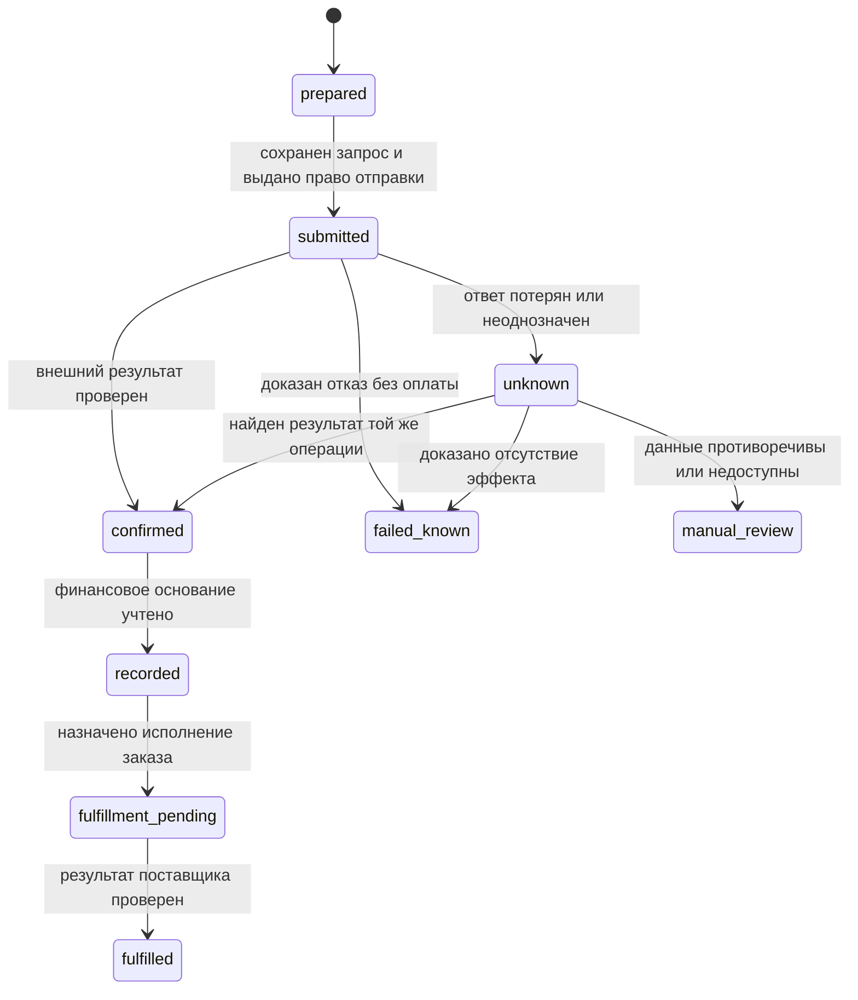
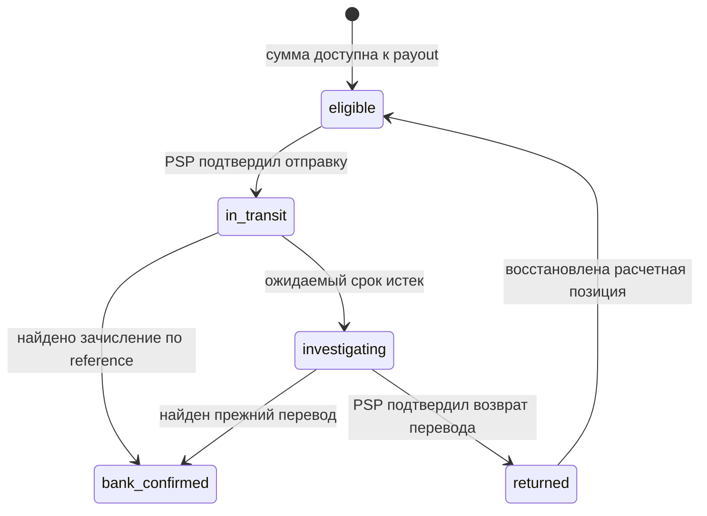

> Публичная редакция от 18.09.2026. Даты проверки и ограничения источников сохранены. Хеши в исторических аудитах относятся к исходной рукописи; публичные изменения и текущие хеши — в [паспорте издания](../../edition.md).

# Часть 8. Интеграции, продукт и операционка

**Версия:** v0.1 · **Статус:** `independently_reviewed_draft` · **Срез:** 15.09.2026 · **Автор:** исследователь `part_08_research` · **Видимость:** private. Первая рецензия: см. REVIEW.md (исторический или служебный материал; сохранен у владельца, вне этой копии).

Фактчек исходной редакции завершен17.09.2026. Связь исходной версии с публичной копией, область адаптации и текущая навигация описаны в паспорте издания.

Эта часть объясняет, как соединить магазин, платежного провайдера и учет так, чтобы успешный запрос превращался в проверяемый результат покупателя. Она охватывает интерфейсы commerce-платформ, проектирование коннектора, ежедневную сверку, доказательства продуктовых обещаний, денежный журнал и восстановление после сбоев. Все числа и компании в учебных примерах синтетические. Реальные документы компаний показывают их собственные API и опыт, а не готовность какого-либо продукта Lab.

Предварительно полезны [учет 0.5](../part-00/chapter.md), [модели ответственности 1.3](../part-01/chapter.md), [платежные состояния части 2](../part-02/chapter.md) и [PSP/PayFac/MoR части 4](../part-04/chapter.md). После чтения вы сможете:

- различить доступ к каталогу, право менять заказ и возможность обработать платеж;
- восстановить неизвестный результат операции, сохранив ее идентичность;
- пройти от заказа через выписку PSP к банку и объяснить каждое расхождение;
- проверить денежные инварианты и превратить рекламное обещание в измеримый критерий пилота.

## 8.1 Commerce platforms

**Вопрос:** почему доступный API магазина еще не означает, что через него можно безопасно продавать и принимать деньги? **Ответ:** магазин описывает товар и заказ; платежный участник подтверждает платеж в своем контуре; продавец исполняет обязательство. Интеграция должна связать эти факты, сохранив границы прав.

### Три предмета интеграции

Каталог — сведения о SKU, варианте товара, цене и наличии. Корзина — выбранный состав покупки до окончательного заказа. Заказ — сохраненное коммерческое намерение с суммой, валютой, покупателем и правилами исполнения. Платежная попытка относится к заказу, но имеет собственные идентификаторы и состояния. Один заказ может иметь неудачную попытку и затем успешную; два capture могут относиться к одному заказу с частичной отгрузкой. Поэтому поле `paid=true` не заменяет историю денег.

Доступ к данным также не дает права распоряжаться ими произвольно. Backend магазина может читать заказы для сверки; браузеру покупателя нужен только его собственный контекст. Идентификатор заказа, переданный пользователем, нельзя считать разрешением читать чужой заказ. Коннектору следует получать ровно те права, которые требуются выбранному сценарию: например, чтение каталога отдельно от возвратов и изменения платежных реквизитов.

### WooCommerce: две API-поверхности и два checkout

WooCommerce Store API предназначен для клиентских сценариев каталога, корзины и checkout. Документация называет его unauthenticated в смысле отсутствия обычных API keys, но отдельно ограничивает доступ текущим покупателем и требует защитные токены для изменяющих запросов. Это не анонимный административный доступ. Authenticated WooCommerce REST API используется для более широкого чтения и изменения данных магазина; документация показывает ключи пользователя с правами и пространство `wc/v3`, тогда как Store API использует `wc/store/v1`. [P08-C001–C002; Store API](https://developer.woocommerce.com/docs/apis/store-api/), [REST API](https://developer.woocommerce.com/docs/apis/rest-api/).

Платежный gateway — расширение, связывающее WooCommerce с обработчиком платежа. В классическом checkout метод `process_payment` управляет обработкой и возвратом результата для интерфейса. В официальном примере оплаты чеком результат `success` возвращается при заказе `On-Hold`: это успех программного шага, деньги еще ожидаются. Вызов `payment_complete` допустим после проверенного основания считать оплату состоявшейся в выбранной модели; он управляет также состоянием заказа и складскими действиями. [P08-C003; Payment Gateway API, Creating a basic payment gateway / process_payment](https://developer.woocommerce.com/docs/features/payments/payment-gateway-api/).

Совместимость такого gateway с Checkout Blocks не следует автоматически. Для Blocks есть клиентская регистрация метода и серверная интеграция через `AbstractPaymentMethodType`; документация явно отделяет ее от Payment Gateway API. Возможность повторно использовать серверную обработку старого gateway не подтверждает наличие необходимых компонентов в блоковом интерфейсе. При приёмке проверяют фактический checkout, установленную версию WooCommerce, расширение и поддержанные сценарии. [P08-C004; Payment method integration, Server Side Integration / Processing Payments](https://developer.woocommerce.com/docs/block-development/extensible-blocks/cart-and-checkout-blocks/checkout-payment-methods/payment-method-integration/).

Важно различать направления уведомлений. Исходящий WooCommerce webhook сообщает внешнему приложению об изменении заказа или товара. Входящий callback PSP приносит магазину сведения о платеже. Настройка первого не создает второй. WooCommerce описывает отключение исходящего webhook после пяти неудачных повторов по умолчанию; это настраиваемое поведение, а не обещание бесконечной доставки. Условия повторов PSP проверяют в его документации. [P08-C005; WooCommerce webhooks, Creating webhooks](https://developer.woocommerce.com/docs/best-practices/urls-and-routing/webhooks/).

### Shopify: приложение, интерфейс и обработка платежа

На Shopify обычное приложение, Checkout UI extension и Payments extension решают разные задачи. Первое получает разрешенные данные и операции приложения. Второе меняет поддерживаемые элементы checkout. Третье интегрирует платежный сервис и проходит отдельные требования платформы. По прочитанным 15.09.2026 docs payments extensions доступны одобренным Partners; для custom payments extensions указана дополнительная eligibility Shopify Plus. UI extensions на information/shipping/payment шагах также ограничены Plus, но наличие Plus само по себе не заменяет одобрение платежного расширения. [P08-C006–C007; Extensions for payments](https://shopify.dev/docs/apps/build/payments), [Checkout UI extensions, selector 2026-07](https://shopify.dev/docs/api/checkout-ui-extensions/latest).

Практический вывод: обещание «подключим платежи к любому Shopify-магазину за один вызов» требует сначала установить допустимую поверхность интеграции. Разрешенный внешний интерфейс каталога не позволяет обойти ограничения checkout. Headless означает отделение пользовательского интерфейса от commerce-backend; договоры, роли платежных участников, доступные операции и ответственность сохраняются. Собственный frontend не превращает оператора интерфейса в эквайера и не делает невозможный платежный метод доступным магазину.

### Adobe Commerce и собственный backend

Adobe Commerce описывает payment provider gateway как слой между sales management и PSP. В нем разделены команды, построение запроса, клиент, проверка и обработка ответа; перечислены authorize, sale, capture, refund и void. Это удобная карта обязанностей адаптера, но перечень операций платформы не гарантирует поддержку каждой операции конкретным PSP и методом. [P08-C008; Commerce payment provider gateway](https://developer.adobe.com/commerce/php/development/payments-integrations/payment-gateway/).

Собственный backend переносит эти обязанности на команду: расчет цены, резервирование товара, создание заказа, платежная попытка, проверка внешнего результата, выдача, возврат. Удалить платформу из схемы можно; удалить сами обязательства нельзя. Полезная таблица приемки содержит не бренды, а строки «создать заказ», «получить фактическую цену», «узнать текущий payment status», «вернуть часть суммы», «восстановить пропущенное событие» и ответственного за каждую строку.

### Пример: последняя единица товара

Два клиента одновременно увидели одну лицензию за 50 USD. Простое чтение каталога не зарезервировало ее. Если оба платежа прошли, а лицензия одна, магазин получил 100 USD против возможности исполнить только 50 USD. Проверка цены и остатка непосредственно перед созданием подтвержденного заказа уменьшает окно гонки; атомарная запись резерва с временем истечения предотвращает двойное распределение в самом магазине. Но внешняя оплата все равно может завершиться после истечения резерва.

Поэтому схема заранее определяет поздний платеж: повторно проверить наличие; при возможности исполнить тот же заказ; иначе сформировать обязательство возврата и провести его отдельно. Нельзя стереть успешную оплату, заменив заказ на `failed`. Для клиента нужен понятный результат: «оплата подтверждена, товар ожидает выдачи» либо «возврат инициирован, его зачисление еще проверяется». Главная ошибка здесь — использовать один статус для наличия товара, денег и доставки.

## 8.2 Connector design

**Вопрос:** как коннектор должен переживать повтор, задержку и частичный сбой? **Ответ:** каждой экономической операции нужна долговечная идентичность, проверяемые переходы состояния и отдельный путь восстановления.

### Что хранить до внешнего действия

Коннектор связывает локальную операцию с чужими объектами. До отправки платежного запроса он сохраняет `operation_id`, магазин/tenant, order ID, сумму и валюту, разрешенное действие, выбранного провайдера и fingerprint существенных параметров. Fingerprint — контрольное представление параметров, позволяющее обнаружить, что под прежним ключом пытаются отправить уже другую сумму. Секреты и персональные данные в ключ не включают.

| Ключ | Что обозначает | Почему не заменяется соседним |
|---|---|---|
| `order_id` | Коммерческий заказ | Не различает его попытки и частичные capture |
| `payment_attempt_id` | Одну попытку выбранным методом | Повтор транспорта должен ссылаться на ту же попытку |
| `operation_id` | Capture, refund или другое действие | Новый refund — новая операция, retry того же refund — прежняя |
| `provider_payment_id` | Объект PSP | Не обязательно идентифицирует каждое движение баланса |
| `provider_balance_tx_id` / modification ID | Конкретное финансовое изменение | Нужен для проводки и сверки, учитывая contract scope |
| `event_id`, `delivery_id` | Событие и его доставка | Подтверждение приема сообщения не равно учету денег |
| `payout_id`, bank reference | Групповая выплата и ее внешний след | Один payout обычно включает много операций |

Это предлагаемая внутренняя модель, а не универсальный набор полей всех PSP. Например, Adyen предупреждает, что Modification Reference для chargeback в некоторых случаях совпадает с reference capture. Поэтому уникальность нельзя строить по одному «красиво выглядящему» ID без типа записи, merchant account и контракта источника. [P08-C009; Settlement details report, Columns](https://docs.adyen.com/reporting/settlement-reconciliation/transaction-level/settlement-details-report/).

### Идемпотентность имеет границу

Идемпотентность означает, что допустимый повтор того же действия не создает дополнительного экономического эффекта. Для Stripe API v1 документация описывает сохранение первого результата начавшего исполнение запроса, включая `500`; повтор с тем же ключом возвращает сохраненный результат. Ключи могут удаляться после возраста не менее 24 часов; повтор после удаления может стать новым запросом. Ошибки проверки параметров и некоторые конфликты конкурентного исполнения не сохраняют результат. Это конкретный контракт, не общая гарантия всех API. [P08-C010; Idempotent requests](https://docs.stripe.com/api/idempotent_requests).

Внутренний срок хранения операции поэтому выбирают по жизненному циклу платежа, расследования и учетным требованиям, а не равным минимальному окну PSP. Ключ нужен вместе с результатом, параметрами, состоянием и ссылкой на внешнюю операцию. Запись в памяти процесса пропадет при рестарте; локальная база должна защищать уникальность и одновременную обработку несколькими workers. Блокировка только в браузере не мешает повтору из другого устройства.

AWS объясняет полезное свойство контрактов повторов: ответ на повтор должен сохранять смысл первоначального результата для клиента. Также отдельно разбираются поздние запросы и повтор одного идентификатора с другим намерением. Это помогает отличать «пользователь снова хочет купить такой же товар» от «сеть повторила прошлый запрос». [P08-C011; Making retries safe with idempotent APIs, Retries and semantic equivalence / Late arriving requests](https://aws.amazon.com/builders-library/making-retries-safe-with-idempotent-APIs/).

### Научная опора: что требуется для exactly once

Работа Lee, Park, Kejriwal, Matsushita и Ousterhout, SOSP 2015, описывает RIFL: уникальный RPC ID, устойчивую запись результата, ее атомарное сохранение с изменениями и обнаружение этой записи после миграции данных. Авторы отдельно учитывают очистку записей и срок жизни клиента. Это исследование распределенного хранилища; оно не доказывает сквозное exactly-once между независимыми PSP, магазином и банком. Учебный вывод уже: обещание «ровно один эффект» требует указать, какие изменения покрывает атомарность и как восстановление находит прежний результат. [P08-C012; RIFL, §§2–4, PDF pp. 3–6](https://web.stanford.edu/~ouster/cgi-bin/papers/rifl.pdf).

### Собственная машина состояний

Следующая схема — проектный пример, не названия статусов конкретного провайдера:

`confirmed` здесь обязательно уточняется типом доказательства: authorization, capture, поступление on-chain или иной факт. Оно не означает «вся цепочка завершена». Состояние заказа и состояния settlement/payout продолжают жить отдельно. Refund и chargeback — новые события, а не перемотка истории успешной покупки назад.

Если подтверждена только authorization, `recorded` означает сохраненный факт блокировки в операционной модели. Он не дает основания автоматически создать требование к PSP или выручку из примера 8.5. Для каждой разновидности операции переход к финансовой проводке имеет собственный критерий.

После сетевого timeout нельзя заключить, что PSP ничего не сделал. Stripe прямо рассматривает результат server error как потенциально неопределенный, с возможными пользовательскими эффектами. Следует расследовать исходную операцию по сохраненным IDs, событиям и отчетам; документированный повтор с тем же ключом и параметрами возможен внутри действующего контракта. Создание нового ключа или смена PSP для неизвестной старой оплаты создает риск второго списания. [P08-C013; Advanced error handling, Server errors / Idempotency](https://docs.stripe.com/error-low-level).

### Inbox, outbox и граница подтверждения

Inbox — устойчивое хранилище принятых входящих сообщений. Обработчик проверяет подпись и контекст, сохраняет сообщение либо надежно ставит его в очередь, затем быстро подтверждает прием. Worker отдельно применяет бизнес-изменение. Если сначала ответить `200`, а потом процесс упадет до сохранения, уведомление может быть потеряно для приложения.

Outbox — запись о предстоящем исходящем действии в той же транзакции базы, где меняется локальное состояние. Например, «платеж учтен» и «заказ надо выдать» фиксируются вместе. Отдельный процесс читает outbox и обращается к fulfillment-сервису. Он может отправить сообщение повторно, поэтому получателю также нужна защита от повторного эффекта. Outbox закрывает локальную проблему двух записей — «состояние сохранили, уведомление потеряли»; он не делает чужой API частью транзакции своей базы. [P08-C014; AWS Transactional outbox, Intent / Issues and considerations / Implementation](https://docs.aws.amazon.com/prescriptive-guidance/latest/cloud-design-patterns/transactional-outbox.html).

Блокировка worker должна сопровождаться версией/правом выполнения: проснувшийся старый worker не должен перезаписать более новое решение. Но даже fencing token собственной базы не останавливает уже отправленный чужому PSP запрос. Это еще одна причина хранить состояние `unknown`, а не начинать новую оплату после истечения локального lock.

### Пример: on-chain оплата есть, заказа нет

Покупатель отправил 20 USDC на указанный адрес в нужной сети. Магазин вернул timeout при создании заказа. Коннектор сохранил quote ID, payment operation ID и транзакцию, но order ID пока отсутствует. Нельзя повторно взять 20 USDC и нельзя объявить продажу завершенной.

Восстановление сначала проверяет ту же транзакцию: сеть, asset/contract, получателя, сумму и достижение принятого критерия подтверждения. Затем ищет исходный заказ по внешней ссылке, поскольку timeout мог произойти после его создания. Если заказ найден, связывает существующие объекты. Если доказано, что заказа нет, и товар доступен, создает его однократно по прежнему намерению. Если выполнить покупку нельзя, фиксирует обязательство вернуть 20 USDC и открывает отдельный возврат по согласованным условиям. Комиссия сети в другом активе учитывается отдельно.

В журнале магазина такое поступление до исполнения может соответствовать активу и обязательству перед покупателем, а не выручке. Конкретная правовая роль держателя адреса, допустимость custody и окончательность сети рассматриваются в [частях 1](../part-01/chapter.md) и [6](../part-06/chapter.md). Пример описывает восстановление данных и обязательств, не разрешение принять чужие средства.

## 8.3 Reporting, reconciliation, ops

**Вопрос:** если webhooks уже обрабатываются, зачем нужны отчеты и ежедневная сверка? **Ответ:** уведомление ускоряет реакцию; сверка обнаруживает то, о чем уведомление не пришло, пришло дважды или было понято неверно.

### От события к закрываемому периоду

Reporting — представление данных за период. Reconciliation — сопоставление независимых наборов записей с объяснением отличий. Close — управляемое закрытие периода после проверки полноты, корректности и оставшихся исключений. Красивый отчет может быть построен на неполных данных; закрывать период по наличию dashboard нельзя.

У операции несколько времен: создание заказа, событие у PSP, получение webhook, дата доступности денег, включение в settlement batch, отправка payout и банковская дата. Хранят UTC timestamp и исходную зону/деловую дату отчета. При сравнении сначала согласуют границы периода. Продажа в 23:59 одного дня и settlement следующего не обязаны попадать в один отчет.

Adyen Settlement details report содержит отдельные типы строк для транзакций, комиссий, корректировок резервов и выплат. `MerchantPayout` содержит ссылку и номер batch для сопоставления с банковским следом. Это означает, что gross продаж нельзя напрямую сравнивать с одной строкой банка: нужны промежуточные изменения. [P08-C015; Settlement details report, Report structure / Merchant payout](https://docs.adyen.com/reporting/settlement-reconciliation/transaction-level/settlement-details-report/).

Stripe Payout reconciliation ориентирован на automatic payouts и показывает состав выплат и незавершенный остаток. Для manual payouts без оговоренного случая платформы с automatic payouts у connected accounts документация направляет к Balance report; instant payouts также требуют собственной сверки. Выбор неправильного отчета способен создать кажущееся расхождение даже при правильных платежах. [P08-C016; Payout reconciliation, Overview / Report details](https://docs.stripe.com/reports/payout-reconciliation).

### Ежедневный цикл оператора

Предлагаемый цикл состоит из пяти шагов. Первый — получить полный набор данных с контрольными признаками: account, среда, валюта, период, номер файла/batch, страницы, число строк и итог. Второй — нормализовать его без потери исходных IDs и денежных единиц. Третий — сопоставить строки с журналом. Четвертый — создать исключения, назначив владельца. Пятый — проверить payout по банку или on-chain факту и сохранить результат close.

Пропуск страницы при чтении API — потеря данных, даже если каждый полученный ответ был `200`. Повторный импорт одного файла не должен создавать новые проводки. Новый файл с корректировкой старого периода, напротив, нельзя просто отбросить по совпавшей дате: нужна версия/идентичность отчета и сравнение строк. Хранят происхождение каждой нормализованной записи и результаты обработки; только изменяемой сводной таблицы недостаточно.

### Очередь исключений

Исключение должно быть объектом работы: сумма и валюта риска, связанные IDs, тип расхождения, возраст, владелец, следующий шаг, срок и ссылки на доказательства. Aging — распределение таких объектов по времени ожидания. Оно отличает нормальную задержку settlement от зависших денег.

| Исключение | Что проверять первым | Ответственный контур |
|---|---|---|
| Заказ ожидает, PSP подтверждает capture | Привязку попытки, сумму, currency, очередь выдачи | Payment ops + fulfillment |
| Ledger содержит платеж, PSP его не находит | Account/environment, исходный ответ, сохраненный key | Connector owner |
| PSP отправил payout, банк не показывает зачисление | Reference, cut-off, статус возврата перевода | Treasury |
| Банк показывает сумму без payout | Отправителя, назначение, отдельную корректировку | Accounting/treasury |
| Refund принят, но не завершен | Тот же refund ID и его внешний статус | Payment ops/support |
| Остаток отличается на комиссию | Отчетный тип, валюта комиссии, повторное списание | Accounting + connector |

Это распределение обязанностей, не перенос финансовой ответственности на сотрудника поддержки. Поддержка собирает сведения и объясняет наблюдаемое состояние; решение о новом переводе или списании принимает обладатель соответствующих полномочий.

### «Деньги ушли, товар не отдали»

У клиента может быть блокировка на карте, завершенное списание, банковский перевод или транзакция сети. Эти доказательства не взаимозаменяемы. Сначала поддержка связывает обращение с магазином, заказом, временем, суммой и валютой; не просит полный номер карты или секрет кошелька. Затем оператор определяет текущий внешний факт и статус товара. Скриншот клиента помогает найти операцию, но не заменяет проверку в системе участника.

Синтетический случай: клиент заплатил 40 EUR; PSP подтверждает успешную оплату; worker выдачи лицензии остановился. Выписка PSP и запись ledger сходятся. Финансовой ошибки нет, но обязательство продавца не исполнено. Повторный платеж только ухудшит ситуацию. Нужно безопасно возобновить выдачу с исходным fulfillment ID, проверить единственную лицензию и сообщить клиенту результат. Если выдача невозможна, возврат становится отдельной отслеживаемой операцией. Документация Stripe предупреждает, что нельзя полагаться на клиентскую страницу для запуска fulfillment: пользователь может уйти после оплаты. [P08-C017; Verify payment status, Monitor a PaymentIntent with webhooks](https://docs.stripe.com/payments/payment-intents/verifying-status).

### Treasury break-glass

Break-glass — заранее определенный аварийный доступ, позволяющий выполнить ограниченное действие при отказе обычного контура. Он не должен означать «выдать всем права на кошелек». В учебном плане фиксируют trigger, владельца решения, конкретный счет/сеть, максимальный объем, разрешенные получатели, срок доступа и обязательную последующую сверку. Второй исполнитель проверяет исходную операцию и реквизиты; журнал объясняет основание каждого действия.

Например, PSP недоступен, а 30 подтвержденных возвратов ожидают исполнения. Перевод клиентам из другого банка может закрыть обязательство только после проверки, что исходный PSP не исполнит их одновременно, и проверки допустимого альтернативного маршрута. Список «pending» сам по себе этого не доказывает. В сомнительном случае нужно управлять задержкой и коммуникацией, а не создавать возможные двойные выплаты. Связь с резервами ликвидности и аварийной политикой — [6.7](../part-06/chapter.md).

## 8.4 Go-to-market claims hygiene

**Вопрос:** какое обещание можно вынести на сайт платежного продукта? **Ответ:** такое, для которого определены субъект, маршрут, условия доступности и наблюдаемое доказательство. Широкая формулировка не должна скрывать узкий scope пилота.

### Обещание начинается с модели ответственности

Следующая таблица использует пять **учебных**, а не законодательных категорий из 1.3. Она задает метод проверки текста; не подтверждает юридическую допустимость модели в конкретной стране.

| Модель | Что именно проверять в обещании | Опасный пропуск |
|---|---|---|
| 1. Software connector | Какое ПО соединяется, кто принимает платеж, у кого merchant account | «Мы принимаем деньги», когда оператор лишь передает данные |
| 2. Direct merchant–PSP | Договор продавца с PSP, страна аккаунта, метод, settlement | «Любой продавец», хотя onboarding и eligibility ограничены |
| 3. Platform / PayFac | Модель charges/transfers, onboarding, ответственность за отрицательный баланс | «Никаких платежных рисков» при регрессе к платформе |
| 4. MoR / reseller | Кто продавец в договоре/чеке, scope налогов, refunds и disputes | «MoR» как название кнопки без реальной роли продавца |
| 5. Own payment stack / custody | Кто контролирует средства, регулируемый субъект, лицензия/партнерство и их scope | «Собственный банк» как синоним API кошелька |

Проверка состоит не в выборе красивой строки, а в сопоставлении утверждения с договором и фактическим маршрутом. Если на сайте написано «деньги получает продавец напрямую», надо установить, на чьем балансе они находятся до выплаты и кто вправе менять получателя. Если обещан возврат, требуется проверить его денежный источник, API, сроки обработки и подтверждение результата.

### Geography и APM list hygiene

APM — alternative payment method, альтернативный платежный метод. Список его логотипов должен быть производным от матрицы возможностей. Строка матрицы содержит: юридическое лицо продавца, business location, страну покупателя, currency, метод/rail, продукт PSP, checkout-поверхность, тип операции, eligibility, статус тестирования и дату проверки.

Stripe прямо разделяет business location, customer country, валюты, продуктовую и API-поддержку; у connected accounts условия могут отличаться. Поэтому объединить все страны и все валюты из разных строк в одно «worldwide» некорректно. Поддержка разовой оплаты не доказывает recurring; возможность charge не доказывает partial refund или payout в той же валюте. [P08-C018; Payment method support, Country and currency support / Product support](https://docs.stripe.com/payments/payment-methods/payment-method-support).

Синтетический пример: коннектор прошел 12 sandbox-сценариев для магазина в стране A, карточной оплаты в EUR и одного checkout. Корректный результат — «проверена интеграция этих сценариев в sandbox». Из него не следует, что реальному merchant account разрешена работа, что деньги поступили в банк или что доступен любой метод в стране B. Даже production authorization не заменяет payout и fulfillment evidence.

### Зрелость продукта и лестница доказательств

Announcement подтверждает публикацию намерения. Private preview означает ограниченный доступ на условиях издателя; public preview не означает принятую эксплуатационную готовность. GA — объявленная общая доступность в указанном scope, но не отсутствие eligibility, региональных ограничений и исключений. Версия спецификации — отдельная характеристика: стабильная спецификация и незавершенный продукт могут существовать одновременно.

Для собственного продукта полезна лестница доказательств:

1. Документированный API contract: какие действия вообще предусмотрены.
2. Доступ и разрешенная модель: кто и на каких условиях может их выполнять.
3. Тестовый результат: определенный набор сценариев прошел в указанной среде.
4. Подтвержденная реальная операция: сумма, external ID, ledger, соответствующее движение средств.
5. Клиентский результат: товар выдан или обязательство корректно закрыто.
6. Повторяемость: наблюдаемый период, объем, ошибки, восстановление и поддержка.

Эта лестница — редакционный метод. Ни количество API routes, ни число регистраций, ни процент HTTP `200` не подменяют следующие ступени. У рекламного тезиса должен быть owner, источник, дата и событие, после которого его пересматривают: новая страна, PSP, версия интеграции или изменение условий.

### Пилотный чеклист с прекращением эксперимента

Синтетический пилот: один продавец, один SKU за 25 EUR, 20 покупок, максимальная совокупная сумма 500 EUR, один согласованный маршрут. До начала фиксируют legal model, rail, geography и роли; возможность возврата; допустимую формулировку на сайте; способ сверки и владельца исключений. Это учебные лимиты, не рекомендация или разрешение запускать такой пилот.

Критерии успеха: каждую успешную покупку можно связать с внешним платежом, записью учета и выдачей; одна и та же попытка не создает повторного эффекта; контролируемый частичный возврат восстановим по истории. Kill criteria — условия остановки новых покупок: двойное списание, неизвестный получатель средств, нарушение денежного инварианта, необъясненный остаток старше согласованного порога, невозможность исполнить возврат. Остановка приема не отменяет обслуживание уже возникших обязательств.

## 8.5 Ledger, сверка и финансовые инварианты

**Вопрос:** что значит «деньги сходятся»? **Ответ:** внутренние записи арифметически сбалансированы, правильно отражают обязательства и сопоставлены с внешними источниками. Одно условие не заменяет остальные.

### Журнал событий, subledger и general ledger

Журнал событий сообщает, что система наблюдала: запрос отправлен, webhook получен, заказ выдан. Бухгалтерский журнал — набор денежных записей по счетам с основанием. Subledger — подробный учет отдельного участка, например расчетов с PSP по каждой операции. General ledger — главная книга организации, куда данные попадают по утвержденной учетной политике. Один технический event может не создавать проводку, создавать несколько записей или требовать предварительной проверки.

Ниже используется **операционный subledger продавца**, который продает собственный товар напрямую через PSP. Продавец рассматривает сумму к получению от PSP как актив, свою обязанность вернуть деньги — как обязательство. Это синтетическая модель контроля, не универсальная IFRS/GAAP-политика: момент признания выручки, principal/agent, налоги, стоимость товара, impairment и отчетная классификация требуют учета конкретного договора и проверки бухгалтером.

Дебет и кредит — стороны записи, не синонимы «хорошо» и «плохо». Для активов увеличение обычно отражают по дебету; для обязательств и капитала — по кредиту. В каждой валюте сумма дебетов журнала равна сумме кредитов. Trial balance — оборотно-сальдовая проверка конечных остатков по этим сторонам. Ее равенство необходимо, но не исключает одинаково сбалансированную ошибку или пропуск. [P08-C019; ACCA, FA2 Examiner’s report, Example 3, p. 3](https://www.accaglobal.com/content/dam/acca/global/PDF-students/fia/examreports/fa2/fa2-examreport-jul-dec2016.pdf).

### Pending, posted и available

`Posted` означает, что запись принята в соответствующий учетный контур. `Pending` описывает ожидающее состояние по правилам этого контура. `Available` — сколько можно использовать сейчас с учетом ограничений. Эти оси нельзя автоматически свести к одному порядку. Учетная запись может быть posted, а отраженные ею средства — еще недоступны к payout.

Stripe Balance Transaction отдельно содержит `amount`, `fee`, `net`, `currency`, `available_on` и `status`; определение `available_on` относится к доступности net funds в Stripe balance, а не к банковскому зачислению. Не следует трактовать одно поле как универсальное доказательство finality. [P08-C020; Balance Transaction object, Attributes](https://docs.stripe.com/api/balance_transactions/object).

Для своего subledger задают правила явно: `PSP pending` — подтвержденное требование к PSP до доступности; `PSP reserve` — удержанное требование; `PSP position` — расчетная позиция, которая может стать долгом продавца; `in transit` — средства между подтвержденными точками движения; `bank` — учтенное банковское зачисление. Резерв не является расходом, пока он остается принадлежащим продавцу требованием; расход и риск невозврата рассматривают отдельно.

### Полный синтетический цикл в USD

Начальные условия: у магазина 1 000,00 USD собственного капитала в банке, других остатков нет. Проданы и выданы два цифровых товара: заказ A на 120,00 и B на 80,00 USD. По **учебному договору** processing fee составляет 3,90 и 2,70 USD; резерв 10% от gross; fee не возвращается. Позже по A возвращают 30,00 USD с отдельной комиссией 1,00. После release резерва по B окончательно проигран спор на 80,00 USD с fee 15,00. PSP разрешает отрицательную позицию до пополнения. Это не тариф или учетная политика названного провайдера.

Все суммы в следующем журнале — USD. Проводки объединяют две продажи для компактности; аналитика сохраняет A/B и отдельные PSP IDs. Проводка J1 делается по проверенному финансовому основанию PSP, не по authorization или HTTP-ответу.

| № / время | Основание | Дебет | Кредит | Сумма |
|---|---|---|---|---:|
| J0 / начало | Внесен капитал | Банк | Капитал | 1 000,00 |
| J1 / день 1 | PSP признал средства двух покупок | PSP pending | Обязательство исполнить заказы | 200,00 |
| J2 / день 1 | Обе лицензии выданы | Обязательство исполнить заказы | Выручка | 200,00 |
| J3 / день 1 | Processing fees A/B | Расходы PSP | PSP pending | 6,60 |
| J4 / день 1 | Удержан резерв | PSP reserve | PSP pending | 20,00 |
| J5 / день 2 | Net доступен для выплаты | PSP position | PSP pending | 173,40 |
| J6 / день 2 | Payout P1 отправлен | Выплата в пути | PSP position | 173,40 |
| J7 / день 3 | Банк подтвердил P1 | Банк | Выплата в пути | 173,40 |
| J8 / день 4 | Принят частичный возврат A | Возвраты продаж | Обязательство возврата | 30,00 |
| J9 / день 4 | PSP исполнил возврат R1 | Обязательство возврата | PSP position | 30,00 |
| J10 / день 4 | Комиссия R1 | Расходы PSP | PSP position | 1,00 |
| J11 / день 5 | Весь резерв освобожден | PSP position | PSP reserve | 20,00 |
| J12 / день 6 | Chargeback B окончательно проигран | Убыток по спору | PSP position | 80,00 |
| J13 / день 6 | Комиссия спора | Расходы PSP | PSP position | 15,00 |
| J14 / день 7 | Пополнение T1 ушло из банка | Пополнение в пути | Банк | 106,00 |
| J15 / день 8 | PSP зачислил T1 | PSP position | Пополнение в пути | 106,00 |

После J3–J5: `200 − 6,60 − 20 = 173,40` доступно, 20,00 удержано, pending обнулен. После J6 банк еще не вырос: 173,40 находится в пути. Только J7 увеличивает банк до 1 173,40.

Это учебная схема выплаты; `investigating` не означает автоматический повтор перевода.

После возврата позиция PSP равна `0 − 30 − 1 = −31,00`. Release резерва дает `−31 + 20 = −11,00`. Спор и его комиссия приводят к `−11 − 80 − 15 = −106,00`. Это кредитовый остаток, то есть долг продавца PSP; доступно для payout ноль. Его нельзя показать клиенту как отрицательный «доступный актив» без объяснения. Пополнение 106,00 закрывает долг, снижая банк до **1 067,40 USD**.

J8 признает обязательство refund отдельно от его исполнения J9. Аналогично, отправка T1 и зачисление у PSP — два факта. При споре в процессе, а не окончательно проигранном, потребовалась бы другая временная классификация; пример не задает универсальный момент признания dispute loss. Также refund request accepted не является доказательством, что банк покупателя уже отразил зачисление.

### Внешние контрольные данные

Синтетическая выписка PSP содержит следующие движения **совокупной позиции**, включая резерв; внутренний перевод pending→available или reserve→available не меняет ее итог.

| PSP event | Изменение USD | Остаток USD |
|---|---:|---:|
| Начало | — | 0,00 |
| Sale A | +120,00 | 120,00 |
| Sale B | +80,00 | 200,00 |
| Fee A | −3,90 | 196,10 |
| Fee B | −2,70 | 193,40 |
| Payout P1 | −173,40 | 20,00 |
| Refund R1 | −30,00 | −10,00 |
| Refund fee | −1,00 | −11,00 |
| Chargeback B | −80,00 | −91,00 |
| Dispute fee | −15,00 | −106,00 |
| Top-up T1 | +106,00 | 0,00 |

Выписка банка: начало 1 000,00; поступление P1 `+173,40`; списание T1 `−106,00`; конец **1 067,40**. Коммерческий реестр: выполненные заказы A/B `200,00`; возврат A `30,00`; проигранный спор B `80,00`. Экономический результат без прочих расходов: `200 − 30 − 80 − 6,60 − 1 − 15 = 67,40`. Изменение банка `173,40 − 106 = 67,40` совпало с ним только потому, что весь цикл закрыт и прочие остатки нулевые.

### Конечный trial balance

| Счет | Дебетовый остаток | Кредитовый остаток |
|---|---:|---:|
| Банк | 1 067,40 | — |
| Возвраты продаж | 30,00 | — |
| Расходы PSP: 6,60 + 1 + 15 | 22,60 | — |
| Убыток по спору | 80,00 | — |
| Капитал | — | 1 000,00 |
| Выручка | — | 200,00 |
| PSP pending/reserve/position, оба in-transit, обязательства | 0,00 | 0,00 |
| **Итого** | **1 200,00** | **1 200,00** |

«Банк равен выручке» здесь очевидно неверно. Выручка gross — 200,00; коммерческая выручка после refund — 170,00; из нее еще не вычтены dispute loss и fees. Payout 173,40 тоже не является прибылью: он произошел до возврата и спора.

### Найти missing и duplicate event

Теперь внесем две ошибки в учет, оставив внешние операции прежними. Webhook R1 потерян, поэтому J9 не создана, хотя J8 уже есть. Позднее другая доставка/импорт повторно признает processing fee 6,60: дебет расходов, кредит PSP position. Это повтор **экономического события**, даже если transport event ID новый.

Ошибочный итог: PSP position **+23,40** вместо нуля, незакрытое обязательство refund **30,00**, расходы PSP **29,20** вместо 22,60. Причина расхождения PSP: `+30,00 пропущенного списания − 6,60 повторной комиссии = +23,40`. При этом trial balance все еще равен: дебеты `1 067,40 + 23,40 + 30 + 29,20 + 80 = 1 230,00`; кредиты `1 000 + 200 + 30 = 1 230,00`.

Сверка обнаружит refund в PSP без финансовой записи и повтор fee относительно одной исходной операции. Исправление: провести пропущенную J9 по найденному R1; обратной записью отменить лишние 6,60 — дебет PSP position, кредит расходов PSP. Старые записи не удаляют: добавляют ссылку на исправляемую запись, основание, время и проверившего. После этого возвращаемся к trial balance 1 200,00 и внешнему нулевому остатку PSP.

### Трехсторонняя сверка и close

Первая сторона — коммерческий реестр и внутренний subledger: заказ, capture, refund, обязательство выдачи. Вторая — PSP/network statement: какие деньги и корректировки признает внешний участник. Третья — банк либо проверяемая on-chain запись на конечном адресе. Это можно записать как `order ↔ ledger ↔ provider ↔ bank/chain`; название «трехсторонняя» группирует order/ledger во внутреннюю сторону, не позволяет пропустить проверку заказа.

Матч проводят по точным идентификаторам, account, currency и типу операции. Совпадение суммы и дня — кандидат, не доказательство: два заказа по 20 USD не взаимозаменяемы. Для payout допустима связь many-to-one; для частичного refund — one-to-many относительно платежа. Отдельно сверяют количество строк, gross, fees, refunds, reserves, in-transit и конечные остатки. Неразрешенные различия сохраняют с aging и владельцем; не прячут их в «прочее», чтобы получить ноль.

### Мультивалютность и точность

Сумма всегда хранится с валютой/asset и единицей. 1 000 означает 10,00 USD только при известном exponent 2. Stripe документирует исключения: например, 5 ISK передается как 500 для совместимости, хотя дробные ISK не принимаются. Поэтому таблица ISO minor units сама по себе не заменяет контракт конкретного API. Decimal либо целые единицы с масштабом предпочтительнее двоичного floating point для денежной арифметики. [P08-C021; Supported currencies, Special cases](https://docs.stripe.com/currencies).

Отдельный синтетический FX-пример: покупатель платит 100,00 EUR. PSP конвертирует по 1,1000 USD/EUR: gross settlement 110,00 USD. Conversion fee 1,10 USD, processing fee 3,20 USD, net 105,70 USD. Это не `100 − 4,30 = 95,70`: валюты различаются. В исходной валюте сохраняется продажа 100 EUR; в расчетной — 110 USD и две комиссии. Если промежуточный учет велся по 1,0800, первоначальная оценка требования 108 USD; при расчете отдельно объясняется разница 2 USD. Ее отчетная квалификация зависит от учетной политики.

Возврат 25 EUR при новом курсе 1,1200 требует 28,00 USD до отдельной комиссии. Он не равен четверти старого net: `105,70 / 4 = 26,425 USD`. При округлении three-way сверка должна знать, на каком шаге и по какому правилу округлял PSP. Разницы округления имеют отдельное основание и лимит; ими нельзя маскировать пропущенный платеж. Денежный баланс строят по каждой валюте, а сводный отчет — через явный курс и дату оценки, никогда простым сложением EUR, USD и токенов.

## 8.6 Надежность, безопасность и восстановление

**Вопрос:** что важнее — всегда отвечать или никогда не потерять деньги? **Ответ:** нужны измеримые цели по обоим направлениям; при неопределенности система должна сохранять факты и ограничивать новые эффекты.

### Duplicate, out-of-order и omission

Stripe не гарантирует порядок доставки событий и описывает автоматические повторы до трех дней в live mode. Поэтому пропущенное сообщение восстанавливают из других доступных источников, а позднее событие не должно слепо откатывать текущее состояние. Доставка может повториться уже после ручной обработки. [P08-C022; Stripe webhooks, Event delivery behaviors](https://docs.stripe.com/webhooks).

У Shopify webhook reference с selector 2026-07 различает `X-Shopify-Webhook-Id`, идентифицирующий delivery, и `X-Shopify-Event-Id`, общий для доставок одного merchant action. Это не order ID и не платежный ID. Несколько подписок могут создать разные delivery IDs для одного действия. Нужно определить, какие потребители обязаны независимо обработать событие, а где возникает недопустимый повтор бизнес-эффекта. [P08-C023; Shopify Webhooks, Headers](https://shopify.dev/docs/api/webhooks/latest).

Shopify рекомендует persistent duplicate tracking, быстрое подтверждение HTTPS-доставки и периодический reconciliation job; для HTTPS описаны one-second connection и five-second overall timeouts. Эти интервалы нельзя переносить на WooCommerce или PSP. [P08-C024; Verify webhook deliveries, Ignoring duplicates / HTTPS delivery considerations](https://shopify.dev/docs/apps/build/webhooks/verify-deliveries).

Синтетический порядок: сначала пришло `refund.completed`, затем старое `payment.succeeded`. Правильный обработчик сохраняет оба факта и рассчитывает net outcome; он не заменяет «возвращено» на «оплачено» только потому, что второе сообщение пришло позднее. Если refund ссылается на неизвестный payment, сообщение помещают в ожидание зависимости и запрашивают связанный объект. Время получения не является порядком экономических событий.

### Подлинность, права и злоупотребление

Webhook endpoint проверяет подпись на исходных байтах тела, правильный signing secret и соответствие tenant/account/environment. Документация Stripe отдельно предупреждает об изменении raw body middleware при проверке подписи. [P08-C025; Resolve webhook signature verification errors, Check the request body](https://docs.stripe.com/webhooks/signature).

Подпись подтверждает источник сообщения в своем контракте, но не право выполнить любую операцию, написанную в payload. Сумма, получатель, asset и связь с локальным заказом также проверяются. Replay protection требует проверки свежести там, где контракт подписывает timestamp, и дедупликации: в Stripe timestamp входит в подпись, а повторная доставка получает новую подпись и время. Свежесть delivery не доказывает новизну бизнес-события. [P08-C026; Stripe webhooks, Preventing replay attacks](https://docs.stripe.com/webhooks).

Секреты хранят вне журналов и клиентского кода; доступ чтения отчетов отделяют от refunds и payout. Изменение банковского получателя — отдельное чувствительное действие с подтверждением владельца, проверкой реквизитов по независимому каналу и audit trail. Recovery не должен незаметно расширять права. Входящие свободные тексты, включая инструкции для агента, остаются данными; они не могут менять allowlist получателей или лимит расходов.

Даже корректно авторизованный API можно использовать во вред бизнесу. OWASP API6:2023 рассматривает злоупотребление чувствительными потоками, например массовое резервирование ограниченного ресурса. Для платежного коннектора отсюда следует проверять не только запросы в секунду, но и число активных резервов, совокупную сумму, многократные возвраты и аномальные попытки по одному principal. Это проектные меры, а не утверждение о конкретной атаке на магазин. [P08-C027; OWASP API6:2023, Is the API Vulnerable? / Example Attack Scenarios](https://api-security.owasp.org/editions/2023/en/0xa6-unrestricted-access-to-sensitive-business-flows/).

### Наблюдаемость результата

Availability SLI показывает долю доступных запросов; финансовые инварианты показывают сохранность денег. В учебной системе полезно независимо измерять: число и сумму unknown операций; возраст «payment confirmed, fulfillment pending»; разницу ledger/provider/bank по валютам; возраст денег в пути; повторные финансовые записи; долю непривязанных платежей. У метрик есть знаменатель, окно и допустимое исключение. «99,9% запросов успешны» без определения запроса не сообщает, сколько покупателей получили товар.

HTTP-ошибки тоже неодинаковы. Отказ checkout до отправки PSP — известное отсутствие внешней операции. Timeout после отправки — неизвестный результат. Ошибка выдачи после подтвержденной оплаты — возникшее обязательство перед покупателем. Нужны разные алерты и маршруты действий, иначе одна кнопка retry будет одновременно безвредной для чтения и опасной для денег.

### Реальный опыт Monzo: ограниченный резервный контур

Daniel Chatfield и Andrew Lawson в публикации Monzo от 13.02.2025 описали крупный сбой августа 2024, продолжавшийся примерно час, и включение Stand-in. По их рассказу, независимый ограниченный контур поддерживал основные банковские действия. Они описывают durable queue для последующего переноса эффектов и correlation IDs против двойного учета при обратной синхронизации. Это свидетельство инженеров оператора, а не независимая оценка доступности или полный postmortem причины сбоя. [P08-C028; Tolerating full cloud outages with Monzo Stand-in, Syncing state / Correlating data / You might have seen](https://monzo.com/blog/tolerating-full-cloud-outages-with-monzo-stand-in).

Учебный вывод из такого подхода: резервный режим должен иметь ограниченный набор действий, собственный журнал решений и путь возвращения в основной учет. «Переключились на другой сервер» не отвечает на вопрос о платежах, которые оба контура успели увидеть. Для небольшого магазина минимальный резервный режим может быть скромнее: остановить новые оплаты, продолжить доступ к истории и поддержку, сохранить incoming events и безопасно закрывать подтвержденные обязательства.

### Сбой в середине оплаты: два восстановления

**Известный результат.** PSP подтверждает capture 60 USD по исходному ID, журнал создан, выдача не началась из-за остановки worker. После восстановления worker берет прежний fulfillment operation, проверяет отсутствие уже выданного товара, делает одну выдачу и сохраняет evidence. Платеж повторно не отправляется. Если товар уже выдан, задача завершается ссылкой на прежний результат.

**Неизвестный результат.** Запрос capture 60 USD ушел, ответ потерян, PSP status API недоступен. Коннектор сохраняет `unknown`, блокирует новый capture того же намерения и показывает клиенту «проверяем оплату». После восстановления канала он ищет исходную операцию. Найденный success ведет к учету и выдаче; доказанный отказ — к предложению новой попытки. Если установленного способа доказать отсутствие эффекта нет, случай остается на разборе. Истечение таймера не является доказательством отказа.

В обоих случаях «провайдер снова доступен» — начало recovery, а не конец инцидента. Требуются сверка периода сбоя, обработка backlog, проверка повторов и пользовательских обязательств. Очередь очищают только после проверки результатов, а не массовым изменением статуса.

Повторы ограничивают общим deadline, числом попыток и объемом воздействия; задержку увеличивают, добавляя случайный разброс, чтобы множество workers не атаковали восстановившийся PSP одновременно. Эти настройки выбирают по контракту операции. Предохранитель, временно прекращающий новые запросы к недоступному сервису, полезен для ограничения нагрузки; он не меняет уже отправленные `unknown` операции на `failed`. Статусы читают с учетом лимитов API, а большие backlog разбирают постепенно, приоритетно закрывая старые клиентские обязательства. Так восстановление не создает второй инцидент.

### Backup, restore и выход от провайдера

Backup должен включать не только суммы счетов, но и IDs операций, записи дедупликации, связи с внешними объектами, inbox/outbox и необходимые ключи восстановления в защищенном контуре. После restore из старого снимка PSP мог уже исполнить новые операции. Если сразу возобновить выдачу и списания, восстановленная база воспримет их как новые. Поэтому сначала ограничивают изменения, догружают внешние факты после точки восстановления и выполняют сверку.

RPO — допустимая потеря данных по времени; RTO — целевое время восстановления. Даже RPO в несколько секунд может охватывать реальные деньги. «Снимок восстановился» не доказывает соблюдение денежных инвариантов. Учебная проверка restore включает одни и те же платежи до и после сбоя, пропущенные сообщения, late retries и проверку итогов по независимой выписке.

BCBS Principles for operational resilience, March 2021, обращены к банкам: они включают упражнения по тяжелым правдоподобным сценариям, mapping зависимостей, управление третьими сторонами и incident response. Здесь это источник организационных принципов, не утверждение, что документ сам по себе юридически обязателен любому магазину. [P08-C029; Principles 3–6, printed pp. 5–7](https://www.bis.org/publications/202103-guidelines-principles-operational-resilience.pdf).

Exit plan от PSP предусматривает выгрузку истории, сохранение договорных/учетных доказательств, обслуживание оставшихся refunds/disputes, проверку доступности резерва и судьбу токенов/мандатов. Переключение новых покупок не переносит автоматически старые обязательства. Финальное закрытие требует ledger, внешнего расчета и исполнения заказа; каждый незакрытый хвост имеет владельца.

### Публичный вопрос разработчика как упражнение

В r/shopifyDev пользователь **IndicationOne9495** спрашивает, стоит ли всегда ставить Shopify webhooks в очередь, описывая дубли и медленные ответы при росте нагрузки. Абсолютная дата поста не установлена: страница показала относительное `22h ago`, несовместимое с частью crawl metadata. Прочитан именно публичный текст; объем нагрузки и причины независимо не подтверждены. [P08-C030; исходный пост](https://www.reddit.com/r/shopifyDev/comments/1vtcxj0/do_you_process_shopify_webhooks_inline_or_always/).

Полезный вопрос к этому случаю — не «какую очередь выбрать», а «в какой момент сообщение стало устойчивым и где предотвращается второй эффект». Ответ `200` перед долговечным сохранением оставляет окно потери. Очередь без дедупликации оставляет окно повторного исполнения. Это вывод из механизма, а не диагноз конкретного приложения автора.

### Упражнения

1. Gateway работает в классическом WooCommerce checkout; команда заявляет поддержку Checkout Blocks. Какие два слоя evidence отсутствуют?
2. После timeout PSP-запроса прошло 25 часов. Можно ли отправить его с тем же Stripe key, считая повтор заведомо безопасным?
3. В цикле 8.5 банк получил 173,40 USD, резерв 20 USD еще удержан, возврата пока нет. Сколько новых денег в банке и сколько требований к PSP? Каков результат после fees?
4. В конце цикла внутренний PSP balance +23,40, внешний ноль; refund payable 30,00; fees 29,20. Найдите обе ошибки и записи исправления.
5. Платеж 80 EUR конвертирован по 1,125 USD/EUR, комиссия 2,50 USD. Позднее refund 20 EUR по 1,150 с fee 0,70 USD. Найдите первоначальный net и последующее списание за refund.
6. Две Shopify subscriptions получили разные delivery IDs и одинаковый event ID. Один consumer отправляет email, другой обновляет каталог. Нужно ли глобально отбросить второй delivery?
7. После restore база не содержит вчерашнего заказа, но PSP сообщает, что его оплата успешна. Назовите безопасный порядок действий.
8. На сайте написано «worldwide, мгновенное settlement», а evidence — sandbox capture и один webhook `200`. Что подтверждено и что необходимо проверить?

---

### Ответы и критерии

1. Нужны клиентская/серверная интеграция payment method с Blocks и проверка фактического полного сценария на нужной версии/конфигурации. Рабочая серверная обработка gateway не подтверждает отображение, передачу данных и результат блокового checkout.
2. Нет такой гарантии: документированная возможность удаления ключа начинается после возраста не менее 24 часов. Сначала расследуют исходную операцию по сохраненным ссылкам и PSP. Сам ключ без знания его действующего scope/срока не доказывает отсутствие второго эффекта.
3. Прирост банка 173,40; требование к PSP в резерве 20,00; результат продаж после fees 193,40. При начальных 1 000 банк равен 1 173,40. Удержание резерва не уменьшило этот результат как расход.
4. Пропущено исполнение refund 30; повторно признано fee 6,60. Дебет refund payable / кредит PSP 30; затем дебет PSP / кредит расходов 6,60. Остатки PSP и refund payable нулевые, расходы 22,60. История сохраняется.
5. Gross `80 × 1,125 = 90,00 USD`, net `87,50 USD`. Refund `20 × 1,150 + 0,70 = 23,70 USD`. Оставшийся денежный результат `63,80 USD`; это не 75% первоначального net, поскольку курс и комиссии различны.
6. Нет. Event ID коррелирует одно действие, но оба разных потребителя могут иметь необходимые эффекты. Дедупликация должна учитывать назначение consumer и экономическую операцию, а не запрещать все вторые доставки глобально.
7. Ограничить новые действия по этому намерению; восстановить исходные IDs и доказательство оплаты; проверить, не был ли товар уже выдан; восстановить учет/заказ; безопасно исполнить только незавершенное обязательство; сверить весь пропущенный период. Новый платеж не нужен.
8. Подтвержден тестовый программный сценарий и прием сообщения. Не подтверждены live eligibility, географии, поступление средств, время settlement/payout и товарный результат. Каждое обещание требует собственного определения и evidence.

### Итог, источники и пробелы

Надежная интеграция сохраняет не только успешный ответ, но и возможность объяснить каждый долг, актив и незавершенный результат. Полный цикл проходит через коммерческое намерение, платеж, журнал, внешний расчет и исполнение; на каждой границе есть свой ID, владелец и способ восстановления.

Каталог: [SOURCES.md](sources.md); ключевые утверждения: [CLAIMS.md](claims.md); ограничения чтения: [RESEARCH_NOTES.md](research-notes.md). Срез 15.09.2026; источники прочитаны 15.09.2026, Asia/Makassar. Динамические docs не закреплены immutable commit. Реальные установленные версии магазинов, merchant eligibility, договоры, тарифы и production resilience не проверялись. Monzo — рассказ оператора; Reddit — атрибутированный вопрос с неизвестной абсолютной датой. Эта глава не является аудитом, учетной политикой или разрешением на запуск.

Далее: [часть 9 — сквозные кейсы](../part-09/chapter.md). Для agentic spending связать эту модель с [частью 7](../part-07/chapter.md): право агента отправить запрос не снимает обязательства доказать денежный и клиентский результат.
