[← Деньги и основы финтеха](../00-Деньги-и-основы-финтеха/README.md) · [Оглавление](../README.md) · [Как проходит платёж →](../02-Как-проходит-платёж/README.md)

# Глава 1. Правила рынка и лицензии

> Кто вправе оказывать платёжную услугу и перед кем отвечает.

**9 уроков** · Срез знаний: **15 сентября 2026** · [Источники](Источники.md) · [Проверка и ограничения](../../Проверка-фактов/Итоги-проверки.md)

## В этой главе

- [1.1 · Зачем регулировать платежи](#module-1-1)
- [1.2 · Лицензии и роли участников](#module-1-2)
- [1.3 · Пять моделей приёма платежей](#module-1-3)
- [1.4 · Как сравнивать страны и правовые режимы](#module-1-4)
- [1.5 · Проверка клиентов, санкции и борьба с отмыванием денег](#module-1-5)
- [1.6 · Защита данных и устойчивость платёжных систем](#module-1-6)
- [1.7 · Работа через партнёра: роли и ограничения](#module-1-7)
- [1.8 · Как читать договоры платёжных участников](#module-1-8)
- [1.9 · Права покупателя и разрешение претензий](#module-1-9)
- [Проверка понимания: задачи и ответы](#проверка-понимания-задачи-и-ответы)

---

Эта часть объясняет, как из фактических действий построить карту прав, денежных обязательств и ответственности. Основной фокус — прием платежей, кошельки и переход между fiat и crypto. Это сравнительный учебник, а не заключение о допустимости конкретного бизнеса. Для эксплуатации необходима проверка применимого местного права и договора профильным специалистом; учебные модели не являются решениями о запуске проектов Lab.

После чтения читатель сможет: различать продавца, технического подрядчика и регулируемого поставщика услуги; нарисовать деньги отдельно от договоров; объяснить ограничения партнерской модели в шести географиях; составить проверяемую карту AML, данных и претензий. Предварительно: [деньги, обязательства и учет — часть 0](../00-Деньги-и-основы-финтеха/README.md). Правила карточек доказательств: [Источники](Источники.md), существенные тезисы: [Утверждения](Утверждения.md).

В тексте **норма** означает положение акта или обязательного правила в указанной сфере; **guidance** — объяснение или надзорное ожидание; **договор** — условия конкретного участника; **интерпретация** — учебный вывод автора. Иллюстрации и числа синтетические, если прямо не указано иное. Дата чтения ссылки не означает, что весь связанный режим проверен до последней национальной поправки.

## 1.1 Зачем регулировать платежи

**Вопрос:** почему две компании с одинаковым checkout могут иметь совершенно разные обязанности? **Ответ:** право смотрит на услугу, обещание клиенту и контроль над результатом. Цвет кнопки и название API этого не определяют.

Платеж создает несколько рисков. Покупатель может потерять деньги до того, как продавец их получит. Посредник может использовать чужие остатки как собственное финансирование. Преступник может провести доход через формально обычную покупку. Пользователь может не понимать цену, курс или адресата претензии. Наконец, отказ крупного участника способен остановить платежи других организаций. Поэтому требования к капиталу, защите клиентских средств, идентификации, раскрытиям и устойчивости решают разные задачи. Исполнение одного требования не доказывает исполнение остальных.

Есть два взаимодополняющих способа определения периметра. **Activity-based regulation** начинается с действия: перевод, выпуск стоимости, хранение ключей, эквайринг. **Entity-based regulation** привязывает часть обязанностей к статусу учреждения: например, банка. Платежное учреждение ЕС получает разрешение на конкретные услуги, а не на «все финансы». В PSD2 платежный счет служит проведению платежей; это не самостоятельное разрешение принимать банковские депозиты. [P01-S001, ст. 11, 18 и приложение I](https://www.boe.es/buscar/doc.php?id=DOUE-L-2015-82575).

Перед классификацией полезно составить три предложения без рекламных слов:

1. **Кто кому должен?** После получения 100 EUR у клиента требование к банку, EMI, продавцу, кастодиану или платформе? Что произойдет при банкротстве каждого?
2. **Кто способен распорядиться?** Кто меняет получателя, подписывает перевод, задерживает выплату, делает refund или блокирует счет? Юридическое полномочие и фактическая техническая возможность могут различаться; проверять надо обе.
3. **Кому и где оказывается услуга?** Где учрежден поставщик; где клиент; где ведется привлечение; какой товар и актив; B2B или B2C; кто обслуживает местный счет?

**Пример.** Компания Alfa продает интернет-магазину программу за 20 EUR в месяц. Покупатель магазина платит непосредственно его PSP, Alfa получает только идентификатор статуса. Затем Alfa добавляет функцию: покупатель сначала пополняет единый остаток у Alfa и распоряжается им у разных магазинов. Денежная сумма и дизайн могут не измениться, но появилось новое требование покупателя к Alfa. Третий вариант: Alfa не держит остаток, однако сама оказывает клиенту услугу инициирования банковского платежа. Из отсутствия денег на банковском счете Alfa нельзя заключить, что регулирования нет: PSD2 прямо отделяет payment initiation и account information от исключения технического поставщика; MAS в 2024 году расширил охват некоторых DPT-посредников, даже если деньги и токены не поступают в их владение. [P01-S001, ст. 3(j), приложение I](https://www.boe.es/buscar/doc.php?id=DOUE-L-2015-82575); [P01-S011, п. 2](https://www.sgpc.gov.sg/api/file/getfile/MAS%20Media%20Release_MAS%20Expands%20Scope%20of%20Regulated%20Payment%20Services%20Introduces%20User%20Protection%20Requirements%20for%20Digital%20Payment%20Token%20Service%20Providers.pdf?path=%2Fsgpcmedia%2Fmedia_releases%2Fmas%2Fpress_release%2FP-20240402-2%2Fattachment%2FMAS+Media+Release_MAS+Expands+Scope+of+Regulated+Payment+Services+Introduces+User+Protection+Requirements+for+Digital+Payment+Token+Service+Providers.pdf).

**География — не адрес сервера.** Иностранная регистрация не стирает местное предложение услуги. Например, новый режим сингапурских digital token service providers специально затрагивает охватываемые лица, обслуживающие исключительно иностранных клиентов. Но обратная крайность тоже неверна: наличие иностранного посетителя сайта само по себе не устанавливает все юридические связи. Нужны факты о таргетировании, заключении договора, исполнении и контроле. [P01-S012, Scope of New Regulation](https://www.sgpc.gov.sg/api/file/getfile/MAS%20Media%20Release%20-%20Clarification%20Statement%20on%20DTSP%20Regulatory%20Regime.pdf?path=%2Fsgpcmedia%2Fmedia_releases%2Fmas%2Fpress_release%2FP-20250606-1%2Fattachment%2FMAS+Media+Release+-+Clarification+Statement+on+DTSP+Regulatory+Regime.pdf).

**B2B и B2C относятся к конкретному отношению.** У платформы может быть корпоративный договор с PSP, у продавца — B2C-продажа физическому лицу, а у этого лица — отдельный договор со своим банком. Надпись «B2B infrastructure» на сайте платформы не отменяет прав покупателя товара. При этом нельзя автоматически переносить потребительские сроки на компанию, купившую услугу для бизнеса. Сначала устанавливают качество стороны в каждом договоре, затем подходящий режим.

Типовая ошибка расследования — начать с вопроса «какая лицензия нужна?» до фиксации этих фактов. Получается ответ на воображаемый продукт. Правильный результат первичного анализа — не список аббревиатур, а диаграмма с участниками, действиями и конкретными неопределенностями.

## 1.2 Лицензии и роли участников

**Вопрос:** что именно подтверждает запись компании в реестре? **Ответ:** только указанный статус, услуги, ограничения и субъект на дату проверки. Она не подтверждает качество продукта и не переносится на другую компанию группы.

**Лицензия/authorization** — разрешение предусмотренного законом вида; **registration** — регистрационный режим, содержание которого зависит от закона. Иногда регистрация связана с AML, иногда с ограниченным видом платежной услуги. **Бизнес-роль** описывает место в цепочке: процессор, шлюз, ISO, PayFac, Merchant of Record. Коммерческие обозначения PSP, «sponsor» или SSP нельзя считать международными категориями разрешения.

Ниже — учебная карта, а не трансграничная таблица эквивалентности лицензий. «Баланс» здесь обозначает экономическое требование и учетную запись; точное отражение custody и safeguarding в финансовой отчетности определяется соответствующим режимом и учетной политикой.

| Действие | Что проверяем по существу | Пример разрешительного периметра | Чьи деньги/обязательство | Кто отвечает пользователю |
|---|---|---|---|---|
| Accept: принять оплату за собственный товар | Продажа или оказание платежной услуги третьему лицу | Сам факт торговли не делает продавца PI; эквайринг как услуга выделен отдельно | Выручка продавца; до расчета требование к acquiring-цепочке | Продавец — за товар; PSP — за свою платежную услугу |
| Hold: сохранять стоимость | Депозит, e-money, платежные средства в процессе перевода или crypto-custody | Банк / EMI / соответствующий PSP или CASP — в зависимости от фактов | У клиента требование; режим защиты различается | Именованный эмитент/держатель/поставщик услуги |
| Transfer: переводить | Кто получает поручение и исполняет перевод | PI/remittance, US money transmitter, MAS money transfer или DPT-service | Обычно передаваемые клиентские средства, не доход посредника | Поставщик перевода в пределах закона и договора |
| Convert: обменивать | Fiat FX, обмен crypto/fiat, исполнение поручения или собственная торговля | Разные режимы FX, CASP/VASP, DPT или exchange business | Актив одного вида заменяется другим; есть риск курса и контрагента | Контрагент обмена и соответствующий посредник |
| Payout: выплатить продавцу | Погашение собственного долга или перевод чужих средств | Название payout само по себе ничего не решает | Требование продавца уменьшается; счет получателя кредитуется | Должник и поставщик перевода по разным основаниям |
| Issue: выпустить | Карта/платежный инструмент, e-money или токен | Issuing-разрешение, банковский/EMI-периметр, специальные token rules | Инструмент дает доступ; выпущенная денежная стоимость создает требование | Эмитент; программа/дистрибьютор — за собственные действия |

Источники определения ролей: [FCA, payment services и e-money](https://www.fca.org.uk/firms/payment-services-regulations-e-money-regulations), [MiCA, recitals 18–22; scope limitations в SOURCES](https://www.boe.es/buscar/doc.php?id=DOUE-L-2023-80808), [BI, PBI 10/2025](https://www.bi.go.id/id/publikasi/peraturan/Documents/PBI-102025.pdf). Таблица — авторский сравнительный синтез; локальные разрешения не взаимозаменяемы.

**Три отношения с партнером.** При аутсорсинге подрядчик выполняет функцию для регулируемого учреждения. При агентской модели он действует от имени principal в установленном объеме; может требоваться регистрация агента. White-label описывает брендинг, а не один из этих правовых статусов. В ЕС использование агента и передача важных функций не освобождают платежное учреждение от ответственности; контроль аутсорсинга описан в ст.19(6), а полная ответственность — в ст.20(2) PSD2. [P01-S001](https://www.boe.es/buscar/doc.php?id=DOUE-L-2015-82575).

**Пример регистрации против лицензии.** US-компания показывает FinCEN MSB registration и обещает «полную лицензию на хранение долларов для всего мира». Такая формулировка не следует из регистрации. FinCEN прямо разъясняет: MSB registration не является лицензией на работу в США; регистрация также не означает одобрения бизнеса ведомством. Применимые разрешения штатов и территорий проверяются отдельно. [P01-S064](https://www.fincen.gov/system/files/2024-12/Alert-FinCEN-Scams-FINAL508.pdf), p6; [P01-C021](Утверждения.md). Даже платежный процессор, претендующий на исключение, должен соответствовать фактам и условиям исключения. FinCEN в FIN-2014-R009 отдельно исследовал ISO и payment processing, включая договор с продавцом и использование регулируемых clearing/settlement-систем. Это конкретное административное толкование, а не универсальное освобождение любого checkout. [P01-S002](https://www.fincen.gov/resources/statutes-regulations/administrative-rulings/application-money-services-business).

Проверка партнера поэтому идет от **точного legal entity** к реестру, от реестра к перечисленным услугам и от них к вашему потоку. Затем проверяют разрешенную агентскую/подрядную роль и договор. Сертификат сестринской компании, логотип схемы или письмо sales не заполняют отсутствующее звено.

## 1.3 Пять моделей приёма платежей

**Вопрос:** какие модели стоит различать до обсуждения API? **Ответ:** кто продает, кто оказывает платежную услугу, кто контролирует средства и кто несет отрицательный результат. Следующие пять моделей — учебные крайние случаи. Реальные продукты комбинируют их, поэтому нельзя автоматически считать любую platform PayFac, любой reseller MoR или любой собственный процессинг custody.

### Модель 1. Software connector

Программа помогает продавцу подключить платежного партнера. В этом примере она передает технические данные, не принимает поручение на регулируемую услугу от своего имени и не распоряжается средствами. Никакой универсальной «software exemption» мы не предполагаем: квалификация меняется, если меняются эти факты.

**Договоры:**

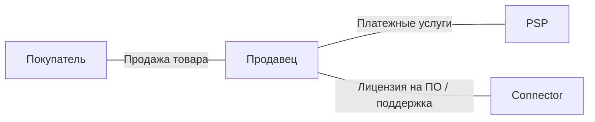

**Деньги; 100 EUR за товар, 3 EUR комиссия PSP, 2 EUR отдельная плата за ПО:**

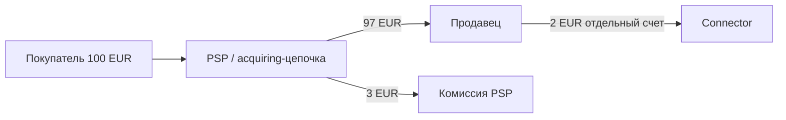

Продавец получает 97 EUR и после оплаты ПО сохраняет 95 EUR. Connector заработал 2 EUR; через него не прошли 100 EUR покупателя. Возврат товара адресуется продавцу. Ошибка интеграции — connector по договору поддержки. Спор по карте проходит через issuer/acquirer, а не исчезает из-за технической роли connector. AML платежного партнера остается у соответствующего обязанного лица; подрядчику могут поручить сбор данных, но договор о разработке сам по себе не делегирует ему решение об открытии счета.

**Сбой:** connector видит timeout и создает новую оплату вместо проверки первой. Техническая ошибка способна породить двойное списание, даже если connector не держит деньги. Поэтому нельзя обещать «никакой ответственности»; можно обещать только конкретную функцию и согласованный уровень сервиса. Источник границы technical provider: [PSD2, ст. 3(j)](https://www.boe.es/buscar/doc.php?id=DOUE-L-2015-82575); правила повторов — [часть 8](../08-Интеграции-и-надёжность/README.md).

### Модель 2. Direct merchant–PSP

Продавец напрямую заключает договор платежного обслуживания. Он может использовать готовый hosted checkout без собственного connector. Важное отличие от модели 1 — это схема принятия торговых платежей как целое; модель 1 описывает роль еще одного участника. Эти категории могут сосуществовать.

**Договоры:**

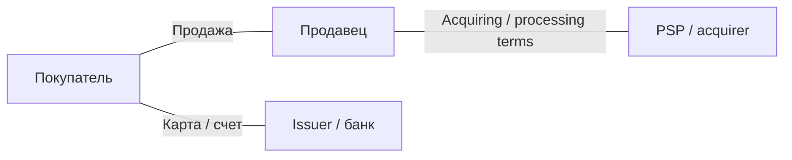

**Деньги:**

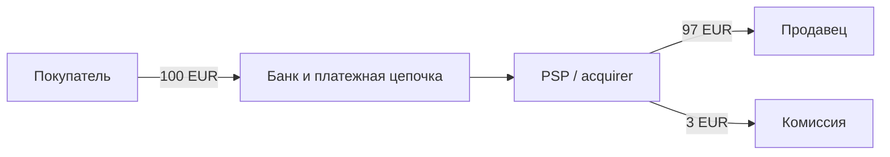

Успешный capture не тождественен доступной выплате 97 EUR. Договор может предусматривать сроки, reserve и удержания. При refund на 100 EUR продавцу может потребоваться довнести 3 EUR, если первоначальная комиссия по учебным условиям не возвращается. Кредитование счета покупателя — отдельный факт от принятия запроса на refund.

**Претензии:** продавец отвечает за товар, PSP — за платежную услугу в ее договорном и законном объеме. Проверка продавца и мониторинг осуществляются платежными участниками по их ролям; идентификация держателя карты его банком не заменяет due diligence продавца эквайером. Нельзя обещать «окончательность без споров» или «выплату в любую страну» на основании общего слова acquiring.

### Модель 3. Platform / PayFac

Платформа объединяет продавцов, onboarding, интерфейс и распределение средств. **Payment facilitator (PayFac)** — конкретная роль в acquiring/scheme-цепочке; платформа может вместо нее работать с прямыми merchant accounts. В примере ниже платформа договорно отвечает перед своим acquiring-партнером за определенные убытки субмерчантов. Это выбранное условие модели, не свойство всех платформ.

**Договоры:**

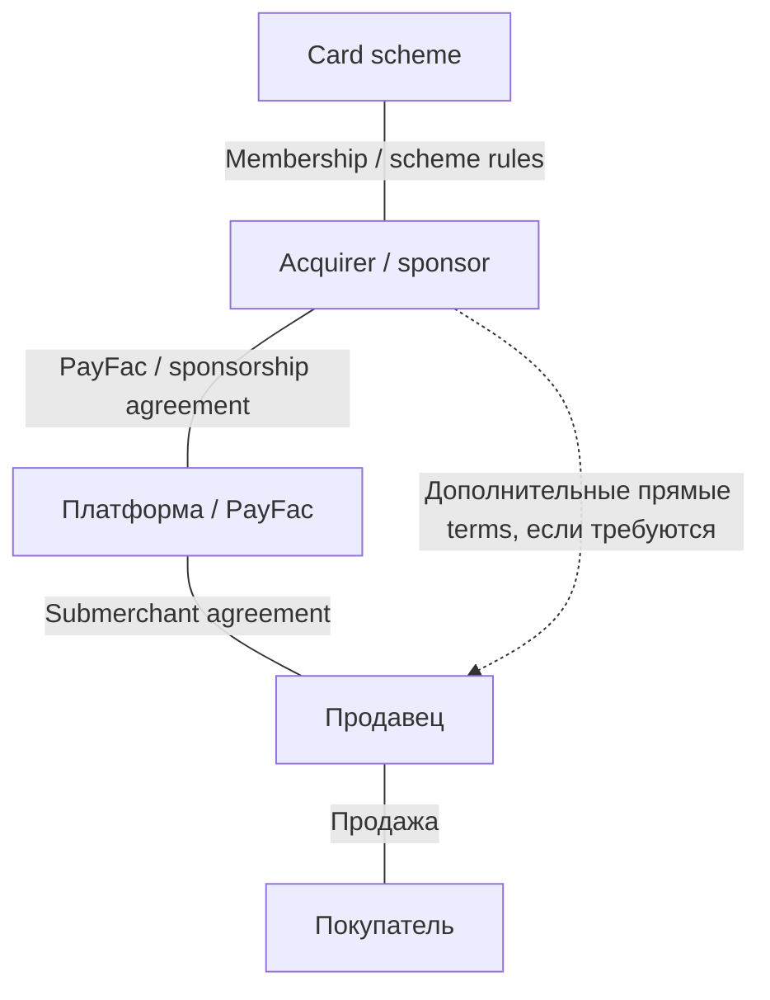

**Деньги; комиссия platform 10 EUR, processing 3 EUR:**

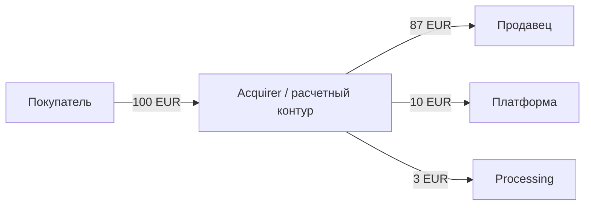

Сумма распределения 87 + 10 + 3 = 100 EUR. Стрелка к платформе не означает, что клиентские средства сначала находились на ее обычном банковском счете: split может осуществлять PSP. И наоборот, красивый dashboard с отдельными балансами не доказывает юридическую сегрегацию денег.

**Сбой:** продавец получил 87 EUR и исчез, покупатель оспорил 100 EUR, а chargeback fee по синтетическому договору равна 15 EUR. Валовой денежный расход по спору — 115 EUR; внутренняя экономика зависит от возвращаемых комиссий и регресса к продавцу. Если платформа удержала свои 10 EUR и ничего более не взыскала, ее чистый результат по этой продаже составляет 10 − 115 = −105 EUR. Нельзя сравнивать риск только с take rate 10%.

Stripe служит полезным публичным контрпримером универсальному правилу: документация Connect различает liability connected account и ответственность платформы за собственный negative balance; тип charge и распределение loss liability имеют значение. Это описание конкретного продукта, не норма закона и не доказательство условий вашего аккаунта. [P01-S032, Marketplace liability / Negative balance responsibility](https://docs.stripe.com/connect/risk-management).

Onboarding-сбор может выполняться платформой, а окончательное принятие merchant — партнером. Кто ведет monitoring, расследует alert и подает SAR/STR, устанавливается применимым законом и operating agreement. Нельзя обещать «подключим любого продавца без проверки» или «мы только интерфейс, все убытки у банка», если договор распределяет обязанности иначе.

### Модель 4. Merchant of Record / reseller

**Merchant of Record (MoR)** в этой модели сам выступает продавцом покупателю; поставщик продукта продает через него на основании отдельного соглашения. Термин не имеет единого всемирного статуса. Необходимо проверить реальную договорную цепочку, налоги и роль в acquiring; одной надписи в выписке недостаточно.

**Договоры:**

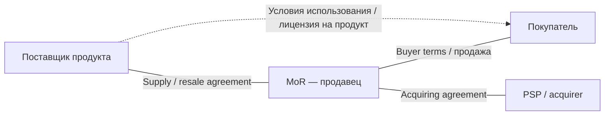

**Деньги; условно без налогов, supply price 90 EUR:**

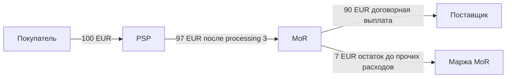

При полной выплате поставщику MoR сохраняет 7 EUR. Если возвращает покупателю 100 EUR, не получает назад processing 3 EUR и по supply terms полностью взыскивает с поставщика 90 EUR, результат MoR: 100 − 3 − 90 − 100 + 90 = −3 EUR. Договор должен объяснять, когда такой регресс возможен; до взыскания у MoR есть потребность в ликвидности.

Публичный MSA Paddle прямо описывает non-exclusive reseller и право продавца обработать refund; он также запрещает поставщику отдельно выставлять покупателю счет за ту же Transaction. Это помогает увидеть различие между поставкой продукта и продажей покупателю. Сама поставка, поддержка, IP и информация о продукте остаются важными обязанностями supplier. [P01-S033, §§2.2(ii), 9, 10.1–10.2](https://www.paddle.com/legal/terms); [P01-S034, Relationship with Suppliers](https://www.paddle.com/legal/buyer-terms).

**Сбой:** supplier обещает клиенту возврат и отправляет деньги напрямую, после чего MoR также исполняет chargeback. В учете возникает двойная компенсация; доступ к продукту мог остаться активным. Поэтому sale/refund должен иметь единого операционного владельца и связанный журнал. Нельзя обещать поставщику «MoR забирает абсолютно все риски, налоги и претензии»: пределы продукта, стран, прав на контент и indemnity определяет договор.

### Модель 5. Own payment stack / custody

Собственный стек — технический выбор. Custody — отдельный вопрос о хранении активов и возможности действовать от имени клиента. Можно написать собственный процессинг и оставаться подрядчиком банка; можно использовать чужой API и при этом быть стороной, принимающей обязательство вернуть клиентский остаток.

**Договоры в учебном варианте custodial wallet:**

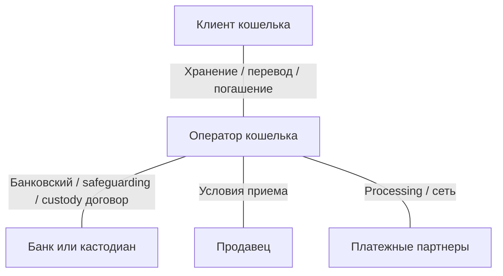

**Деньги/обязательства; 100 EUR пополнение, 30 EUR покупка:**

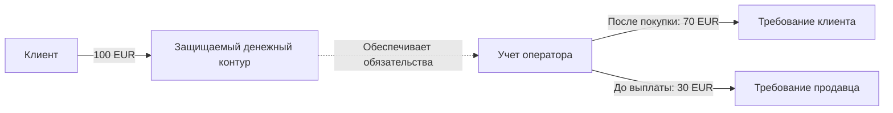

Здесь две нижние стрелки — **не банковские переводы**, а изменение требований. До выплаты актив денежного контура 100 EUR соответствует 70 + 30 EUR обязательств; после выплаты продавцу 30 EUR остается 70 EUR актива и 70 EUR требования клиента. Это не выручка кошелька 100 EUR и не прибыль 30 EUR. Для crypto модель дополняется количеством токенов, адресами, правами на ключи и отдельным учетом fiat-конверсии.

Оператор принимает на себя существенно больше функций: учет, сверку, redemption/withdrawal, мониторинг, доступность и восстановление. Партнеры продолжают нести собственные обязанности, но их наличие не устраняет роль оператора. Нельзя обещать страхование депозита, мгновенную ликвидность или гарантированную номинальную стоимость без отдельного основания. Например, FCA прямо предупреждает, что деньги у небанковского payment/e-money provider не получают прямую защиту FSCS; safeguarding имеет другую конструкцию. [P01-S008 и consumer guidance](https://www.fca.org.uk/consumers/using-payment-service-providers).

**Итог пяти моделей.** Изменение business model — это прежде всего изменение должника и распределения потерь. Новый endpoint, субсчет или token не доказывает, что это изменение юридически оформлено. Перед переходом между моделями следует заново разобрать договор, контролируемые действия и деньги.

## 1.4 Как сравнивать страны и правовые режимы

**Вопрос:** можно ли выбрать одну «удобную лицензию» и обслуживать весь мир? **Ответ:** карта строится по сочетанию деятельности, юридического лица, актива и клиента. Ни одна строка ниже не является разрешением конкретной фирме. Карточки сопоставимы по семи измерениям, но не обещают исчерпывающего анализа каждого национального права. CBDC — обязательство центрального банка; название пилота CBDC не подтверждает доступность коммерческого подключения. Производственный статус CBDC по шести странам здесь не проверялся.

### 1.4.1 США

**Регуляторы и permission.** Федеральный BSA/MSB-анализ FinCEN сосуществует с банковским надзором и законами штатов о money transmission. Услуга приема денег для передачи другому лицу требует отдельного анализа; собственная торговая выручка — другой случай. Bank partnership определяет, какие действия совершает банк, какие — подрядчик, кто предлагает счет и контролирует средства. FinCEN ruling об ISO/payment processor помогает разобрать условия конкретной модели, но не заменяет карту штатов. [P01-S002](https://www.fincen.gov/resources/statutes-regulations/administrative-rulings/application-money-services-business).

**Crypto/stablecoin.** На срез уже существует GENIUS Act — Public Law119-27, одобренный 18.07.2025. Его определения и разрешенные эмитенты относятся к payment stablecoins; это не один режим для любых crypto brokers. Закон нельзя описывать как прежний законопроект. При этом §20 задает условную общую дату: раньше 18 месяцев после принятия либо 120 дней после определенного final implementing regulation. Вторая ветка в этом исследовании полностью не сверена; подтвержденный OCC документ 25.02.2026 — proposal. §3(b)(1) содержит собственный трехлетний срок. Значит, «принят», «правила предложены» и «конкретная обязанность применяется» — три разных утверждения. [P01-S003, §§2–4,20](https://www.govinfo.gov/content/pkg/PLAW-119publ27/html/PLAW-119publ27.htm); [P01-S004](https://www.occ.gov/news-issuances/news-releases/2026/nr-occ-2026-9.html).

**Acquiring, payout и партнерство.** Карточный acquirer принимает merchant по своему договору и scheme-условиям; доступ к ACH или иной банковской выплате не выводится из приема карты. Инженер должен установить, кто подает инструкцию банку, какой счет дебетуется и какое событие подтверждает кредит получателя. Банковская ответственность за переданные функции сохраняется в пределах применимого права; interagency guidance прямо рассматривает весь жизненный цикл отношений с третьими лицами. [P01-S035, Overview](https://www.federalreserve.gov/frrs/guidance/interagency-guidance-on-third-party-relationships.htm).

**Разбор.** Сервис продает «USD wallet», но клиент подписывает только terms сервиса. Банк указан в footer, а остаток ведет сервис. Нельзя назвать этот продукт банковским депозитом только по наличию банка. Для квалификации нужны договор счета, титул на средства, полномочия сервиса, state-by-state perimeter и insolvency treatment. Это конкретные оставшиеся вопросы counsel; вопрос «легален ли fintech в США?» слишком широк. Права consumer EFT дополнительно рассматриваются в 1.9; merchant-quality dispute и unauthorized transfer различаются.

### 1.4.2 EU / EEA

**Регуляторы и permission.** Компетентные национальные органы авторизуют PI/EMI и соответствующие crypto providers; европейские акты задают общую основу. Платежное authorization перечисляет услуги. Процесс passporting нельзя заменить регистрацией торговой марки или обслуживанием через иностранный сайт. Для EEA дополнительно проверяют включение конкретного акта в соглашение EEA и местные даты: «EU» не автоматически означает одинаковую дату во всех странах EEA.

**Payments и реформы.** Учебная основа платежного периметра — PSD2 и национальная имплементация. PSD3/PSR находятся в меняющемся законодательном процессе: политическое соглашение 27.11.2025 и его подтверждение COREPER 22.04.2026 установлены; final OJ/application dates этой проверкой не установлены. Поэтому новые предложения о liability или fraud controls нельзя без проверки вклеить в договор как уже обязательную норму. SCA — требование к аутентификации в соответствующем контексте, а не гарантия отсутствия fraud. [P01-S001](https://www.boe.es/buscar/doc.php?id=DOUE-L-2015-82575); [P01-S007, Next steps](https://www.consilium.europa.eu/en/press/press-releases/2025/11/27/payment-services-council-and-parliament-agree-to-step-up-the-fight-against-fraud-and-increase-transparency/); [P01-S057, строки 5–6](https://data.consilium.europa.eu/doc/document/ST-9814-2026-INIT/en/pdf).

**Crypto и stablecoin.** MiCA различает EMT, привязанные к одной официальной валюте, ART и другие охватываемые crypto-assets; токенизированный финансовый инструмент нельзя автоматически анализировать как MiCA token. Для EMT важен статус эмитента и правила денежной стоимости, для CASP — услуга. ESMA прямо подтвердил: максимальный grandfathering завершился 01.07.2026, причем некоторые страны завершили его раньше. Старый национальный VASP registration сам по себе не подтверждает MiCA authorization на сентябрь 2026. Также лицензия одной компании группы не распространяется на остальные. [P01-S005, recitals18–22 и ст.48](https://www.boe.es/buscar/doc.php?id=DOUE-L-2023-80808); [P01-S006, pp1–3](https://www.esma.europa.eu/sites/default/files/2026-04/ESMA75-113276571-1679_Statement_on_the_end_of_transitional_periods_under_MiCA.pdf).

**Acquiring, payout, партнерство.** Merchant acquiring, банковский перевод и EMT-transfer — отдельные функции. Одобрение crypto custody не доказывает разрешение платежной услуги, доступ к банковскому счету или прием любым acquirer. Агент/аутсорсер действует в установленной роли; regulated principal должен сохранять контроль. Перенос функций не устраняет требования safeguarding, данных и consumer redress.

**Разбор.** Платформа принимает EUR-token, затем выплачивает EUR продавцу. Таблица должна содержать отдельно issuer токена, CASP хранения/обмена и fiat PSP. Если одна группа выполняет все три функции, все равно нужны конкретные entities и разрешения. Открытый юридический узел — наложение MiCA/EMT на payment services, плюс применимый национальный режим и паспорт. Reverse solicitation не следует превращать в систематическую модель привлечения клиентов: ESMA описывает ее как узкое исключение.

### 1.4.3 Великобритания

**Регулятор и permission.** FCA описывает PSRs 2017 и EMRs 2011; бизнесу в UK может понадобиться authorization/registration как PI, EMI либо подходящий более узкий статус. Платежная услуга и выпуск e-money различаются. Post-Brexit анализ проводится по UK perimeter: EU authorization нельзя называть автоматически достаточным разрешением UK. [P01-S008, Scope](https://www.fca.org.uk/firms/payment-services-regulations-e-money-regulations).

**Crypto/stablecoin.** Для каждого продукта отдельно выясняют выпуск, хранение, переводы и systemic status. FCA PS26/10 (июнь 2026) содержит финальные правила выпуска non-systemic UK-issued qualifying stablecoins; §1.2 связывает scope с деятельностью эмитента по Article 9M. Однако приложенные инструменты устанавливают вступление в силу **25.10.2027**. Значит, на срез 15.09.2026 публикация финальных правил еще не означает их применение. Это также не общее разрешение на любой stablecoin checkout. [P01-S062, Summary, §1.2 и Commencement, PDF pp.63,98](https://www.fca.org.uk/publication/policy/ps26-10.pdf) [P01-C051].

Совместный paper BoE/FCA от 30.06.2026 отдельно обсуждает надзор за systemic issuers и переход к нему; консультация открыта до 30.09.2026. Финальный FCA документ не превращает предложения BoE и совместной консультации в действующие правила. [P01-S010, introductory status](https://www.bankofengland.co.uk/paper/2026/boe-and-fcas-approach-to-joint-regulation-of-systemic-stablecoin-issuers).

**Acquiring, payout, партнерство.** Для карт и локальных переводов нужны конкретные payment permissions и договоры доступа. Новый Supplementary Safeguarding Regime действует с 07.05.2026 для охватываемых фирм; будущий end-state — отдельный этап. Поэтому анализ партнера в 2026 должен изучать уже обновленные safeguarding processes, а не довольствоваться старым письмом об отдельном счете. [P01-S009, implementation and scope](https://www.fca.org.uk/publications/policy-statements/ps25-12-changes-safeguarding-regime-payments-and-e-money-firms).

**Разбор.** White-label EMI-приложение обещает «деньги защищены как в банке». Наличие safeguarding не дает основания обещать прямую FSCS protection клиента небанковского PSP. В документе требуется назвать EMI, объяснить конструкцию защиты и порядок доступа при отказе приложения. Оставшиеся вопросы: кто ведет клиентский ledger и reconciliations, как действует агент, какой сценарий insolvency и кто возвращает остатки. Эти вопросы связаны с доказательствами, а не с наличием красивого branded card.

### 1.4.4 Сингапур

**Регулятор и permission.** MAS PSA различает виды платежных услуг и Standard/Major Payment Institution; выбор статуса зависит от услуг и применимых объемных критериев. Численные пороги в этой главе не воспроизводятся: официальный SSO текст был недоступен, а перенос отдельного найденного порога без всех условий создал бы ложную точность. Регистрация holding company в Singapore не заменяет operating permission.

**Crypto/stablecoin.** Прочитанный MAS release подтверждает expansion с 04.04.2024: DPT custody, определенное содействие передачам/обмену даже без possession, а также некоторые cross-border money transfer arrangements без нахождения средств в Singapore. Отдельный overseas-only DTSP regime действует с 30.06.2025; для охватываемых лиц и услуг MAS установил высокую планку лицензирования. Поэтому паттерн «SG hub, все клиенты за рубежом» требует содержательного анализа. [P01-S011, pp1–2](https://www.sgpc.gov.sg/api/file/getfile/MAS%20Media%20Release_MAS%20Expands%20Scope%20of%20Regulated%20Payment%20Services%20Introduces%20User%20Protection%20Requirements%20for%20Digital%20Payment%20Token%20Service%20Providers.pdf?path=%2Fsgpcmedia%2Fmedia_releases%2Fmas%2Fpress_release%2FP-20240402-2%2Fattachment%2FMAS+Media+Release_MAS+Expands+Scope+of+Regulated+Payment+Services+Introduces+User+Protection+Requirements+for+Digital+Payment+Token+Service+Providers.pdf); [P01-S012, Scope](https://www.sgpc.gov.sg/api/file/getfile/MAS%20Media%20Release%20-%20Clarification%20Statement%20on%20DTSP%20Regulatory%20Regime.pdf?path=%2Fsgpcmedia%2Fmedia_releases%2Fmas%2Fpress_release%2FP-20250606-1%2Fattachment%2FMAS+Media+Release+-+Clarification+Statement+on+DTSP+Regulatory+Regime.pdf).

Stablecoin-framework announcement и реализующее законодательство — разные источники. Точная стадия законодательных поправок к 15.09.2026 в доступной первичке полностью не подтверждена; статус 2023 нельзя механически объявить действующим режимом выпуска 2026.

**Acquiring, payout, партнерство.** Merchant acquisition, e-money и DPT — разные строки scope. Поддержка local transfer/QR проверяется в договоре и списке участников конкретной схемы; экспорт API не доказывает доступ к местной выплате. Партнер может исполнять regulated service, а hub — разработку/операции, но документы должны соответствовать реальному управлению.

**Разбор.** Сингапурский оператор организует crypto-to-fiat выплаты между двумя иностранными странами; токены не попадают на его адрес. Старое рассуждение «no possession, no Singapore customers» недостаточно после указанных расширений. Проверяется, какая именно услуга организуется, где принимаются решения, кто клиент каждой стороны и что доверено лицензированному партнеру. Это не означает автоматической квалификации любого разработчика как DTSP.

### 1.4.5 Индонезия

**Регуляторы и permission.** BI регулирует платежную систему; карта цифровых финансовых активов и crypto связана с OJK. С 31.03.2026 применяются PBI10/2025 и PADG32/2025. BI сохраняет термины PJP/PIP, но вводит обновленную систему activity bundles, PSP Utama и оценки TIKMI. PJP получает разрешение, PIP — designation; поддерживающая организация не равна ни одному автоматически. Начальная классификация имеет переходный срок, поэтому нельзя заявлять, что все участники уже окончательно переклассифицированы. [P01-S013, Ringkasan2.7,2.10–2.12](https://www.bi.go.id/id/publikasi/peraturan/Pages/PBI_102025.aspx); [P01-S014](https://www.bi.go.id/id/publikasi/peraturan/Pages/PADG_322025.aspx).

**Crypto/stablecoin.** OJK сообщает о передаче надзора над digital financial assets, включая crypto,10.01.2025; завершение переходного сотрудничества с Bappebti оформлено в январе 2026. Это разные даты. Разрешение торговли активом не доказывает разрешение использовать его как розничный платежный инструмент. В этой части не делается вывод о законности конкретного stablecoin checkout. [P01-S058, SP13/GKPB/OJK/I/2026](https://ojk.go.id/id/berita-dan-kegiatan/siaran-pers/Pages/Nota-Kesepahaman-OJK-Bappebti-2026.aspx).

**Acquiring, payout, APM/QR.** QRIS — стандарт и инфраструктурная схема, а не финансовая лицензия разработчика QR-кода. BI объясняет, что cross-border QR работает через согласованные связи и участвующие PSP; merchant должен проверять поддержку у своего PSP. Уведомление об успешном QR-платеже и settlement через участников — разные события. Локальная выплата IDR требует законного исполнителя и договорной схемы. [P01-S016, QRIS Cross-Border](https://www.bi.go.id/en/fungsi-utama/sistem-pembayaran/ritel/kanal-layanan/QRIS/default.aspx).

**Партнерство и разбор.** Иностранная платформа хочет собирать оплату индонезийских покупателей и распределять ее местным продавцам. Нужна привязка ее роли к партнерскому PJP и конкретному bundle, а не ссылка на старую category license в презентации. В официальном summary BI перечисляет письменное соглашение, DD, security, SLA, audit и exit; отдельные партнерства/развитие услуг требуют предусмотренного согласования. Открытые вопросы: иностранное участие, местное юрлицо, конкретные разрешенные функции, продуктовый approval и место каждой стороны в данных/средствах. [P01-S013,2.12–2.15](https://www.bi.go.id/id/publikasi/peraturan/Pages/PBI_102025.aspx).

### 1.4.6 ОАЭ

**Регуляторы и permission.** Здесь особенно опасно писать единственную строку «UAE licence». Mainland/федеральный платежный контур, Dubai VARA, DIFC DFSA и ADGM FSRA имеют разные границы. VARA объясняет свой охват Dubai за исключением DIFC; DFSA — financial services in/from DIFC. Наличие commercial license свободной зоны не доказывает financial authorization. [P01-S018, Jurisdiction](https://www.vara.ae/en/faq/); [P01-S019, framework scope](https://www.dfsa.ae/crypto).

**Crypto/stablecoin.** CBUAE Payment Token Services Regulation — отдельный источник для token issuance/conversion/custody-transfer; подробные условия merchant acceptance этой проверкой не подтверждены прямым полным текстом из-за 403, поэтому здесь нет обещания «можно принимать любой USD stablecoin». В DIFC DFSA обновил Crypto Token framework с 12.01.2026, включая обязанности фирмы оценивать suitability соответствующих токенов. В ADGM изменения по FRT вступили 01.01.2026, охватывая accepted tokens, regulated activities и клиентские FRT. [P01-S017, bounded access](https://rulebook.centralbank.ae/en/rulebook/payment-token-services-regulation); [P01-S019](https://www.dfsa.ae/crypto); [P01-S020, final-change announcement](https://www.adgm.com/media/announcements/adgm-fsra-finalises-regulatory-framework-for-regulated-activities-involving-fiat-referenced-tokens).

**Acquiring, payout, партнерство.** Card acquiring и AED bank payout требуют отдельной проверки payment/bank scope и банка расчетов; VASP status не является универсальным доступом к этим рельсам. Связь между зонами нельзя выводить из общей страны: нужны действующие правила cross-border/marketing и условия каждой лицензии.

**Разбор.** ADGM-фирма обслуживает custody институциональных клиентов и через приложение предлагает туристам розничную оплату в Dubai. Первая лицензия не доказывает допустимость второй услуги, аудитории и территории. Следует разделить custody, выпуск/прием payment token, конверсию и выплату торговцу. Конкретный оставшийся пробел — актуальные CBUAE статьи и пересечение местных разрешений; неопределенность не превращается в утверждение о запрете всей технологии.

### 1.4.7 Расширение: семь коротких флагов

Это ориентиры для следующего исследования, не дополнительный legal treatise. Каждый флаг должен запускать проверку конкретного разрешения и актуальной редакции. Для BR/TR доступ ограничен индексированными выдержками официальных текстов; эти строки имеют статус working_hypothesis для дальнейшей проверки.

| География | Тип permission и флаг |
|---|---|
| Hong Kong | HKMA stablecoin issuer regime по Stablecoins Ordinance с 01.08.2025; не равен SFC trading permission и не общая лицензия на платежи. [P01-S043](https://www.info.gov.hk/gia/general/202506/06/P2025060600275p.htm) |
| Japan | FSA с 01.06.2026 описывает отдельную регистрацию intermediary для определенного brokerage по поручению principal; старый тезис «посредник всегда full exchange» требует обновления. [P01-S044](https://www.fsa.go.jp/common/shinsei/denanchuukai/index.html) |
| Korea | VASP registration/AML и Virtual Asset User Protection Act с 19.07.2024 решают разные задачи; asset protection не универсальная payment permission. [P01-S045](https://fsc.go.kr/eng/pr010101/82683) |
| Australia | AUSTRAC использует VASP registration в обновленном режиме 2026; переход зависит от услуги и своевременной заявки. AML registration не заменяет иные разрешения. [P01-S046](https://www.austrac.gov.au/new-austrac/register-us/register-us-remittance-or-virtual-asset-service-provider) |
| Brazil | BCB Resolution520 регулирует VASP и действует с 02.02.2026; в тексте есть отдельный будущий срок 30.10.2026 для указанного ограничения контрагентов. Не считать все положения одновременно действующими. [P01-S047, arts91–92](https://www.bcb.gov.br/estabilidadefinanceira/exibenormativo?numero=520&tipo=Resolu%C3%A7%C3%A3o+BCB) |
| Türkiye | CMB CommuniquéIII-35/B.1 опубликовано 13.03.2025 и охватывает establishment/operation crypto providers; отдельно проверять платежный запрет/разрешение, CBRT и AML, без вывода из биржевой роли. [P01-S048, arts1–2](https://cmb.gov.tr/data/6281521a1b41c617eced0ee8/Communiqu%C3%A9%20III-35.B.1%20Regarding%20Principles%20on%20the%20Establishment%20and%20Operation%20of%20Crypto%20Asset%20Service%20Providers.pdf) |
| CIS-adjacent | Для примера AIFC Kazakhstan проверяют конкретную AFSA Digital Asset Service Provider activity. Статус AIFC не переносится на весь Казахстан или соседние страны; fiat/FX/sanctions — отдельные узлы. [P01-S049](https://afsa.aifc.kz/ru/provajdery-uslug-tsifrovyh-aktivov-2/) |

## 1.5 Проверка клиентов, санкции и борьба с отмыванием денег

**Вопрос:** что остается после успешного KYC? **Ответ:** почти весь жизненный цикл отношений. **CDD** — установление клиента и бенефициара, понимание цели отношений и их последующий анализ; **EDD** — усиленные меры при повышенном риске. **UBO** — конечный бенефициар, устанавливаемый через владение и контроль по применимому определению. Паспорт подписанта не объясняет, кому принадлежит компания. FATF R10/R11 задают международный стандарт CDD и сохранения достаточных записей для восстановления операций; он реализуется местным правом. [P01-S021, pp14–15](https://www.fatf-gafi.org/content/dam/fatf-gafi/recommendations/fatf-recommendations-2012.pdf).

Не следует смешивать четыре проверки. KYC устанавливает личность. Merchant DD изучает бизнес, товар, владельцев и ожидаемый поток. Sanctions screening сопоставляет лиц и операции с применимыми ограничениями. Transaction monitoring ищет несоответствия и подозрительные связи в поведении. Одна проверка может дать данные другой, но зеленая отметка одной не является результатом остальных.

### Учебная цепочка crypto → fiat

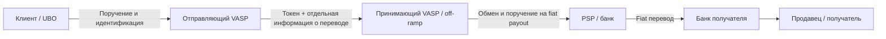

| Точка | Что проверяют в этой модели | Какой риск остается |
|---|---|---|
| VASP отправителя | Клиент, UBO, полномочие, purpose, допустимый адрес/контрагент, необходимые данные перевода | Клиент может быть идентифицирован, но цель операции скрыта |
| VASP получателя | Контрагент-VASP, клиент-получатель, полнота/согласованность данных, адресный риск, возможность принять актив | Onchain receipt может предшествовать допустимости выдачи средств клиенту |
| Off-ramp | Кто продает актив, происхождение и расчетная пара, получатель fiat, связь exchange и payout | Смена актива способна разорвать операционные идентификаторы |
| Банк/PSP | Свой клиент, отправитель/получатель, платежное сообщение, назначение и применимые sanctions | Полученный fiat не содержит полной истории token движения |
| Платформа | Качество переданных данных, собственные fraud-сигналы и исполнение делегированной процедуры | Формальное «партнер проверяет» может скрывать потерянный alert |

Таблица — авторская модель распределения работ, не готовая юридическая RACI. Ответственность за **false negative**, то есть пропущенный риск, определяется собственной законной обязанностью каждого участника и договорным регрессом. Нельзя назначить единственного ответственного «за весь AML» таким образом, чтобы остальные обязанные лица исчезли из цепочки. В software-модели connector может отвечать за целостность данных; в PayFac — за делегированный onboarding/monitoring; у MoR — собственный торговый риск и обязанности его PSP; у custodial operator — существенно более широкий контур. Фактическая роль важнее названия модели.

**Travel Rule — это информация, а не еще один token transfer.** В ЕС Regulation 2023/1113 применяется с 30.12.2024. Ст.14 требует для охватываемого crypto transfer передачу сведений безопасно до или одновременно с переводом; они не обязаны находиться в публичном блокчейне. Для self-hosted addresses есть специальные проверки, включая оценку владения/контроля при указанном пороге свыше 1000 EUR. Это не всеобщий порог «ниже 1000 никто ничего не проверяет». Получающий CASP по ст.17 рассматривает missing information до выдачи средств по risk-based процедуре. [P01-S025, ст.14,16–17,40](https://www.boe.es/buscar/doc.php?id=DOUE-L-2023-80807).

FATF R16 пересматривалась в 2025; консультация по guidance 2026 относится к международному внедрению с горизонтом 2030. Эти даты нельзя смешивать с уже применимым EU TFR или местными правилами другой страны. [P01-S023](https://www.fatf-gafi.org/en/publications/Fatfrecommendations/R16-Public-Consultation-June-2026.html).

**Локальный пример.** BI PADG15/2025, действующий с 30.06.2025, распространяет описанные AML/CTF/proliferation controls на определенных небанковских участников под надзором BI. Summary отдельно включает письменные процедуры, risk management, CDD, управление данными и reporting, а для некоторых B2B intermediaries допускает настройку содержания процедур. Это содержательная локальная норма, а не автоматическое заимствование FATF threshold. [P01-S060, RingkasanII.1–5](https://www.bi.go.id/id/publikasi/peraturan/Pages/PADG_152025.aspx).

### Из alert в проверяемый case

Учебный case начинается с конкретного события: merchant заявил продажу лицензий на ПО, но стал получать платежи от несвязанных компаний с немедленным выводом на нового получателя. Это сигнал к проверке, не доказательство преступления. Case должен соединить исходный профиль, новые факты, операции, запросы документов, заключение ответственного и принятое действие. Закрытие «false positive» требует основания; автоматическое закрытие из-за отсутствия ответа не является положительной проверкой.

Практический журнал содержит: время alert; систему/версию правила; связанные transaction IDs; доступные факты; missing data; ответственного; следующее контрольное время; решение; ссылки на evidence; основание ограничения или снятия ограничения. Секретные сведения и сведения о SAR/STR имеют отдельный доступ. FATF R20/R21 описывают сообщение о подозрении и конфиденциальность; задача сотрудника не состоит в том, чтобы сначала доказать состав преступления. Конкретная FIU, срок и основания подачи определяются местным правом. [P01-S021, p19, INR20p92](https://www.fatf-gafi.org/content/dam/fatf-gafi/recommendations/fatf-recommendations-2012.pdf).

**Предел address screening.** Адрес — не юридическое лицо. Отсутствие метки не устанавливает происхождение средств, а общая инфраструктура может создавать ложные совпадения. Поэтому исходные identity/location/payment данные и актуальные ограничения анализируются совместно. OFAC guidance для virtual currency industry полезна как пример сочетания name, geographic и wallet information; американское санкционное основание устанавливается отдельно. [P01-S024, guidance publication and screening scope](https://ofac.treasury.gov/recent-actions/20211015). Технические способы обхода проверок не входят в учебную задачу.

## 1.6 Защита данных и устойчивость платёжных систем

**Вопрос:** если карта или паспорт находятся у партнера, исчезает ли ответственность нашей интеграции? **Ответ:** область обработки меняется, но ее надо доказать. Токен, vault и сертификат обозначают разные свойства.

**PAN** — номер карты. **Vault token** обычно заменяет его идентификатором у конкретного хранителя; **network token** имеет другую инфраструктуру и правила; **SPT** в конкретном продукте может означать одноразовый платежный credential. Название SPT не является PCI-категорией и не доказывает, что секрет можно писать в лог. Важны фактический payload, возможность использовать credential, путь страницы и доступ интегратора.

| Интеграция | Что меняется | Что все равно проверить |
|---|---|---|
| Redirect на hosted checkout | Карточная форма размещена отдельно у PSP | Настоящий адрес назначения, интеграция, доступы, applicable SAQ и PSP evidence |
| Embedded form/iframe | Карточные поля могут принадлежать PSP, merchant page окружает их | Script attacks на странице, инструкции установки, eligibility SAQ A |
| Собственная форма отправляет card data | Merchant environment участвует в обработке чувствительных данных | Более широкий scope: frontend, backend, логи, monitoring, support, подрядчики |
| Только token в backend | У части сервисов может отсутствовать PAN | Что token позволяет сделать, где он создан, есть ли detokenization, какие системы влияют на безопасность |

PCI SSC FAQ1588 по SAQ A r1/PCI DSS4.0.1 объясняет важную ловушку 2025: для embedded payment form сохраняется eligibility-условие защиты сайта от script attacks. Его можно обосновать указанными техниками либо подтверждением compliant TPSP о защищающем решении при правильной установке. Для redirect эта конкретная проверка сформулирована иначе, но прочие критерии не исчезают. Определение подходящего вопросника сверяется с принимающей его организацией. [P01-S026, FAQ1588](https://www.pcisecuritystandards.org/faqs/1588/).

**Пример.** Команда убрала PAN из базы, но error reporter сохраняет полное тело запроса, а support получает скриншоты формы. Формальное утверждение «мы храним только token» не описывает систему. Для доказательства scope надо проследить данные через UI, API, очередь, журналы, аналитические события и поддержку. AOC партнера проверяют на entity, service, период и exclusions; логотип PCI на сайте не заменяет эти сведения. Это инженерная проверка фактического потока, не самостоятельная сертификация.

### Privacy: цель обработки следует за записью

Платежный лог может содержать имя, адрес, email, IP, устройство, товары и банковские реквизиты. Данные, достаточные для сопоставления операции, не обязательно нужны каждому сотруднику или аналитическому инструменту. **Controller** определяет цели и существенные средства обработки; **processor/data intermediary** обрабатывает в порученной роли. Платежный партнер может быть самостоятельным controller для своих законных обязанностей, а не processor магазина во всем.

В GDPR выбирают legal basis для конкретной цели. Исполнение договора, правовая обязанность, consent и legitimate interests — разные основания с разными условиями. Наличие галочки под terms не освобождает от этого анализа. [P01-S059, legal bases](https://www.edpb.europa.eu/sme/be-compliant/process-personal-data-lawfully_en). Для Singapore PDPA также нельзя считать data intermediary свободным от обязанностей. Руководство PDPC для обработки от имени и для целей другой организации по письменному договору выделяет защиту данных, ограничение хранения и уведомление заказчика об утечке. Обязанности самой организации при передаче обработки сохраняются; иные действия посредника оцениваются отдельно. Это ограниченный разбор ролей; трансграничная передача и конкретный договор требуют местной проверки. [P01-C052; P01-S063, revised29.04.2026, pp.24–25](https://www.pdpc.gov.sg/-/media/Files/PDPC/PDF-Files/Advisory-Guidelines/AG-on-Key-Concepts/Advisory-Guidelines-on-Key-Concepts-in-the-PDPA-17-May-2022.pdf).

Практический вывод виден на Travel Rule: EU TFR ст.25 ограничивает коммерческое использование данных, обработанных на этом основании; ст.26 задает срок хранения и условия последующего удаления/продления. Значит, нельзя автоматически отправлять весь compliance payload в маркетинговый профиль «потому что мы уже законно его собрали». [P01-S025, ст.25–26](https://www.boe.es/buscar/doc.php?id=DOUE-L-2023-80807).

Учебная таблица данных должна иметь пять колонок: поле → цель → кто вправе видеть → основание/срок → место удаления и исключения. Например, transaction ID нужен сверке; содержимое identity document обычно не требуется обычному dashboard продаж. Удаление аккаунта не означает немедленное уничтожение обязательной финансовой записи; законное хранение записи не означает вечное хранение всех вложений. Уведомления об утечке и передача за рубеж анализируются отдельно от того, удалось ли провести платеж.

### Устойчивость: отказ партнера не отменяет долг клиенту

DORA применяется с 17.01.2025 к охватываемым финансовым организациям ЕС; EBA отдельно поясняет register of information о договорных ICT arrangements. Это полезный ориентир: надо знать, какой поставщик поддерживает какую функцию и чем заканчивается цепочка subcontractors. Наличие облачного сервиса не делает каждую компанию автоматически полностью in-scope DORA. [P01-S030](https://eba.europa.eu/activities/direct-supervision-and-oversight/digital-operational-resilience-act/preparation-dora-application).

Учебный инцидент: processor недоступен 40 минут, но банк успел провести часть выплат. Восстановить доступность API недостаточно. Нужно установить неизвестные результаты, сверить ledger, остановить дубли, обработать очереди жалоб и подтвердить состояние каждой операции. **RTO** — допустимое время восстановления; **RPO** — допустимая потеря данных во времени. Для денежных операций восстановление сервиса с потерянными записями может ухудшить ситуацию: пользователь видит кнопку и повторяет уже исполненный перевод.

Поэтому operational plan содержит владельца инцидента, каналы партнеров, временные ограничения, доказательства восстановления и порядок reconciliation. Договор должен дать доступ к сведениям даже при прекращении сотрудничества. Испытание восстановления полезно завершать не сообщением «сервер поднялся», а балансом, списком unresolved операций и подтвержденным пользовательским результатом.

## 1.7 Работа через партнёра: роли и ограничения

**Вопрос:** что можно заключить из намерения работать через партнера? **Ответ:** пока только то, что необходимо спроектировать партнерский контур. Лицензия партнера — один входной документ, а работающая разрешенная модель — результат согласования действий, договоров, контроля средств и данных.

Эта часть имеет учебный статус. Она не присваивает проекту permission и не дает поручения подключать реальные платежи. Техническая возможность сама по себе не устанавливает полномочий; учебные примеры используют синтетические данные.

**Как выглядит содержательное доказательство партнерской модели.** Сначала фиксируют продукт в одном абзаце: продавец, покупатель, актив, страны, обещанный результат. Затем составляют карту действий и документов. Для каждой регулируемой функции должно быть понятно, какое лицо ее выполняет и на каком основании; для каждого перемещения средств — чей долг погашается. Затем договор проверяют против фактического API и управления доступом. Если terms говорят «platform cannot direct payouts», а API key позволяет поменять получателя любого merchant, появляется существенное расхождение для исследования, даже если функция пока не используется.

### Одностраничный DD-чеклист партнера

Это авторский учебный документ. Он развивает идею lifecycle DD из interagency guidance, но не объявляет американское банковское guidance обязательной формой для конкретной компании. [P01-S035, III.B Due diligence](https://www.federalreserve.gov/frrs/guidance/interagency-guidance-on-third-party-relationships.htm).

| Блок | Минимальное проверяемое доказательство | Признак незакрытого вопроса |
|---|---|---|
| Legal entity | Полное название, номер, страна, договорная сторона | Назван только бренд или группа |
| Permissions | Запись регулятора, услуги, ограничения, статус, дата | Sales deck вместо register; registration называют full licence |
| Activity / geo / client | Письменное соответствие конкретному потоку, B2B/B2C и странам | «Worldwide» без исключений и договорного scope |
| Assets / rails | Разрешенные валюты, токены/сети, acquiring, payout routes | Поддержка токена в API выдается за юридическое разрешение |
| Средства | Титул, банк/кастодиан, safeguarding, ledger/reconciliation, insolvency | Только dashboard balance, неизвестен конечный банк |
| AML / sanctions | Распределение onboarding, monitoring, escalation, STR/SAR и доступа к данным | Каждый участник считает, что решение принимает другой |
| Disputes | Refund, chargeback, complaints, ADR, negative balance, reserve | Неясно, кто платит после ухода продавца |
| Данные / безопасность | AOC scope, privacy roles, subprocessors, доступы и уведомления | Универсальная фраза «GDPR/PCI compliant» |
| Устойчивость | История значимых отказов, поддержка, recovery/reconciliation, exit | SLA касается API, но не состояния платежей |
| Экономика / выход | Все fees, currency conversion, reserve release, termination, export | Договор позволяет заморозить все без ясного процесса сверки |

Положительный результат DD означает «доказательства соответствуют заданной модели на дату», а не «риска нет». Утрата лицензии, изменение scope, новая страна, новый токен, изменение собственников, смена банка или новая модель контроля средств запускают повторную проверку. Отказ выдать документ не доказывает нарушение, но оставляет ограничение доказательств; его нельзя заполнить доверием к знакомому менеджеру.

## 1.8 Как читать договоры платёжных участников

**Вопрос:** почему API работает, но обещать прием платежей еще нельзя? **Ответ:** технический доступ не устанавливает все права, лимиты и ответственность. Договорная иерархия определяет, что происходит при споре между красивым интерфейсом, продуктовой документацией и обязательством сторон.

**MSA** задает общую основу отношений. Product addendum уточняет услугу. Pricing schedule определяет комиссии. Acquiring agreement связывает прием торговых платежей с acquirer и применимыми scheme rules. BIN sponsorship относится к соответствующей issuing/program роли и не заменяет acquiring. ISA/ISO/referral agreement может ограничивать сторону привлечением клиентов. Marketplace addendum определяет функции platform/connected account. MoR supply terms — отношения перепродажи/поставки, а не согласие банка обслуживать любую отрасль.

| Модель | Основные подписи | Что особенно важно в иерархии |
|---|---|---|
| Connector | Merchant ↔ software supplier; merchant ↔ PSP | Software terms не расширяют PSP permission |
| Direct merchant | Merchant ↔ acquirer/PSP; buyer ↔ merchant | Processing schedule, prohibited business, refunds, reserves |
| PayFac | Sponsor/acquirer ↔ platform; platform ↔ submerchant; merchant ↔ buyer | Flow-down scheme rules, underwriting, losses и termination |
| MoR | Supplier ↔ reseller; reseller ↔ buyer; reseller ↔ PSP | Supply price, product obligations, taxes, refund/chargeback recovery |
| Custodial operator | User ↔ operator; operator ↔ bank/custodian/processors | Права на актив, withdrawal/redemption, insolvency, control and exit |

Договорные деревья PayFac и MoR показаны в 1.3. Их надо читать сверху и снизу. Сверху поступают ограничения лицензии, схемы и sponsor. Снизу поступают обещания покупателю и доказательства поставки. Если платформа обещает клиенту мгновенный возврат, а upstream договор позволяет только запрос с длительной обработкой, она приняла дополнительное обязательство, которое должна уметь исполнить.

### Пять групп условий, без которых обещание сервиса неполно

1. **Settlement и liquidity.** Как определяется settlement date; какие cutoff, выходные, netting и валюты; когда сумма становится доступной; как меняется график при риске. Reserve — отдельная величина: rolling, fixed, minimum или иной механизм; нужны основания увеличения и release после прекращения работы.
2. **Refund/chargeback и потери.** Кто инициирует refund, кто собирает evidence, кто несет fee и negative balance, как действует регресс, что происходит после merchant insolvency. Лимит ответственности может не покрывать payment obligations, indemnities или специально исключенные случаи — это читают в тексте, а не предполагают.
3. **Scope и прекращение.** Какие товары, страны, merchant categories, assets и client types разрешены; кто может остановить обработку; что происходит с pending payments, reserves, подписками и complaint deadlines после termination. «Расторгли MSA» не значит «все долги исчезли».
4. **Данные, аудит, контроль.** Кто вправе давать поручения, видеть/передавать данные и менять payout account; что доступно регулятору/аудитору; какие уведомления и ограничения для subprocessors. Аудит без права получить ledger может не дать ответа о клиентских деньгах.
5. **Иерархия и изменение условий.** Какая версия signed order/addendum/online terms/scheme rules имеет приоритет; как изменения доводятся; можно ли отказаться; какие пункты сохраняются после прекращения. Indemnity и governing law рассматривают вместе с mandatory local rights.

**Публичный разбор Stripe.** Connected Account Agreement от 18.11.2025 связывает пользователя с соответствующим Stripe entity и включает локальное Services Agreement. §1 описывает полномочия platform; §§4–5 — данные, fees и распределение обязанностей, включая продукт/доставку пользователя. Это полезно инженеру: доступ platform к API может быть основан на поручении account holder, а platform terms — отдельный документ. Из прочтения публичной версии нельзя заключить, что конкретный заказчик подписал именно ее без negotiated amendments. [P01-S031, §§1,4–5](https://stripe.com/legal/connect-account).

**Публичный разбор Paddle.** В reseller-модели buyer и supplier соединены несколькими документами. Supply obligations и buyer terms необходимо сопоставить: кто предоставляет лицензию на контент, кто выставляет счет, кто принимает запрос на refund, кто возмещает reseller спорную сумму. Публичные terms подтверждают реальную модель конкретного вендора; они не являются бесплатным универсальным legal template. [P01-S033](https://www.paddle.com/legal/terms); [P01-S034](https://www.paddle.com/legal/buyer-terms).

**Что читают инженеры.** Полномочия API, idempotency и error states; сроки получения evidence; лимиты и webhook semantics; экспорт данных; процедура остановки; поведение refund и reserve. **Что проверяет counsel.** Квалификацию услуги и сторон, mandatory rights, enforceability, indemnities, governing law, licenses, data transfers. Общая зона — фактическая схема: юрист не видит скрытого изменения получателя без инженера, инженер не выводит законное полномочие из наличия endpoint. Рабочий результат — clause → операционное действие → владелец → проверяемое evidence.

## 1.9 Права покупателя и разрешение претензий

**Вопрос:** если перевод окончателен, закончились ли права покупателя? **Ответ:** нет такого общего вывода. Платежная запись, договор покупки, complaint process и право на возмещение существуют на разных уровнях.

**Chargeback** — процедура в карточной цепочке по применимым правилам схемы; она не равна судебному решению по договору. **Statutory remedy** возникает из закона. **Withdrawal** — право отказаться от соответствующего договора при его условиях. **Voluntary refund** — дополнительная политика продавца. В одном кейсе могут существовать несколько оснований, но это не дает права на двойное возмещение одного ущерба.

| Претензия | Основание | Кто несет обязанность / денежный результат | Время: что фиксировать |
|---|---|---|---|
| Неавторизованный consumer EFT в США | Regulation E, если операция/счет в scope | Обязанности финансового учреждения; liability клиента по отдельным условиям | Error resolution: обычно notice в 60 дней от statement, расследование 10 business days по §1005.11. Loss/theft access device: отдельное правило two business days по §1005.6 |
| Карточный спор о непоставке | Scheme rules + договор с acquirer | Debit по цепочке; merchant/platform liability по условиям | Точный reason code, схема, trigger и срок представления evidence; универсального срока нет |
| Отказ от дистанционного B2C-договора ЕС | Applicable consumer law | Продавец по договору/закону | Общий 14-дневный режим и исключения; начало срока зависит от goods/services |
| Digital content не поставлен/не соответствует | National implementation Directive 2019/770 | Trader; возможный upstream recovery отдельно | Remedy process по arts13–18; необходимые refunds без undue delay, максимум 14 дней от указанного уведомления |
| Возврат по собственной гарантии продавца | Policy/contract | Продавец в обещанном объеме | Сроки policy; обязательные права сохраняются |
| Жалоба на payment provider | Закон/регулятор/ADR и complaint terms | Конкретный provider; компенсация не автоматическое следствие жалобы | Дата получения, final response, eligibility/deadline внешнего рассмотрения |

Источники: [P01-S061, Regulation E§1005.11](https://www.consumerfinance.gov/rules-policy/regulations/1005/11/); [P01-S037, withdrawal guide](https://europa.eu/youreurope/citizens/consumers/shopping/returns/indexamp_en.htm); [P01-S038, arts13–18](https://www.boe.es/buscar/doc.php?id=DOUE-L-2019-80854). Сроки scheme этой частью не верифицированы для каждого reason code, поэтому численная универсальная chargeback-гарантия намеренно не дана.

**EU digital goods.** Отказ без причины и исправление непоставки — разные права. Исключение из withdrawal для определенного начатого digital supply связано с необходимым consent/acknowledgement, а не просто надписью «digital goods non-refundable». Отсутствие withdrawal не устраняет требования conformity. Directive 2019/770 различает несвоевременную поставку, характеристики/совместимость и remedies: исправление, соразмерное уменьшение цены или прекращение при предусмотренных условиях. Ее национальные меры применяются с 01.01.2022. [P01-S037](https://europa.eu/youreurope/citizens/consumers/shopping/returns/indexamp_en.htm); [P01-S038, arts5–9,13–18,22,24](https://www.boe.es/buscar/doc.php?id=DOUE-L-2019-80854).

**US EFT.** В§1005.11 есть определение ошибки и процесс расследования; mere balance inquiry и жалоба на качество фильма — не одно и то же, что incorrect/unauthorized EFT. Общее правило 10 business days имеет специальные сроки и возможность продления при выполнении условий, включая provisional credit. Нельзя превратить его в обещание «банк всегда вернет любой платеж за 10 дней». [P01-S061, (a)–(c)](https://www.consumerfinance.gov/rules-policy/regulations/1005/11/).

**Срок расследования — не безопасное окно для уведомления о краже.** §1005.6(b)(1)–(3) отдельно определяет liability клиента. При известной потере/краже access device уведомление в пределах **двух business days после того, как клиент узнал об этом**, связано с первым уровнем ограничения ответственности; более позднее уведомление может увеличить ее при условиях нормы. Отдельные 60 дней от отправки statement относятся к отраженному unauthorized EFT и риску последующих переводов. Они не отменяют двухдневное правило. [P01-S036, §1005.6(b)(1)–(3)](https://www.consumerfinance.gov/rules-policy/regulations/1005/6/).

### Доказательство digital delivery

Учебный продавец выдал купленный код и отметил order `fulfilled`. Покупатель утверждает, что код уже использован. Лог отправки письма подтверждает передачу сообщения почтовой системе, но не годность кода. Нужна цепочка: SKU и обещанные характеристики → право поставки → созданный entitlement → доступность клиенту → факт использования/ошибка → принятое remedy. Для подписки важны период и часть выполненной услуги; для downloadable content — предоставление доступа и необходимые преддоговорные disclosures.

При возврате следует связать решение, сумму, реальный возврат средств и состояние доступа. Access revocation может предотвратить дальнейшее использование, но нельзя уничтожать данные, которые закон позволяет клиенту получить обратно, или скрывать evidence спора. Не каждый refund требует полного отзыва всех услуг: основание и исполненная часть имеют значение.

**Crypto checkout.** Клиент отправил 50 USDC и получил неработающий цифровой продукт. Отсутствие функции отмены исходной blockchain-транзакции не доказывает отсутствие обязательства продавца возместить цену. Технически возмещение может быть новым переводом. Юридически надо определить сумму/валюту долга, допустимый способ, согласование альтернативы, комиссии и проверенный адрес. Возвращать автоматически на входящий адрес опасно и по смыслу модели: этот адрес мог принадлежать бирже или платежному посреднику. В учебной системе сначала устанавливают право и получателя, затем связывают новое денежное действие с исходным order. Это объяснение механизма, не поручение провести платеж.

### Complaint handling и ADR

**ADR** — внесудебный механизм разрешения спора, применимый при его eligibility rules. Singapore FIDReC проверяет категорию заявителя, участвующее учреждение, предшествующее обращение и сроки; UAE Sanadak текущим порталом использует этап предварительной жалобы LFI и 15 calendar days. Нельзя переносить старый 30-дневный буклет на нынешнюю форму или считать любой спор с fintech автоматически допустимым. [P01-S040, Terms rule13 и eligibility](https://www.fidrec.com.sg/_entity/annotation/63c8379b-6e55-f011-bec2-0022485a9df8); [P01-S042, current portal](https://www.sanadak.gov.ae/en).

Операционная complaint record должна содержать основание претензии, договорную сторону, даты, документы клиента, связанные платежи, результат расследования, мотивированный ответ и доступный дальнейший путь. Статусы `received`, `investigating`, `decision issued`, `refund requested`, `refund credited` полезно разделять. Закрытая support ticket не подтверждает исполненный refund. Complaint data также помогает выявить системную проблему: повторяющийся неработающий код может требовать исправления supply, а не только ускорения ответа поддержки.

## Проверка понимания: задачи и ответы

Все задачи синтетические; ответы демонстрируют метод, а не заключение по реальной компании.

1. **Connector не хранит средства, но принимает и исполняет поручение инициировать банковский платеж. Достаточно ли аргумента «мы software»?** Нет. Установить клиента, полномочие и фактическую услугу; отсутствие possession не устраняет возможный PIS/perimeter. Проверять локальное право.
2. **Партнер показывает разрешение компании A, договор подписывает B той же группы. Что подтверждено?** Только статус A. Для B нужны собственное основание деятельности и роль в цепочке. Бренд не заполняет разрыв.
3. **В учебной PayFac-модели 100 EUR распределены 87/10/3; merchant исчез, спор 100 и fee15. Какой чистый результат platform при сохраненных 10 и без recovery?** −105 EUR. Валовой расход по спору 115 EUR. Liability определяется выбранным условием модели, не универсальной нормой.
4. **EU crypto firm законно работала в 2024 и показывает national registration. Достаточно ли этого 15.09.2026?** Нет: максимальный MiCA grandfathering завершился 01.07.2026. Нужна проверка текущего authorization/notification и exact entity.
5. **GENIUS signed 18.07.2025; OCC опубликовал proposal 25.02.2026. Можно ли вычислить начало 120 дней от proposal?** Нет. §20 требует соответствующего final regulation. Также у отдельных положений собственные сроки.
6. **Старый BI category certificate и новый PSP Utama одинаковы?** Нет. Проверить PBI10/2025/PADG32/2025, activity bundle и transition конкретного участника. Термины PJP/PIP сохранены, но вся карта изменилась.
7. **500 EUR crypto transfer меньше 1000 EUR, значит Travel Rule data не нужны?** Такой вывод неверен. В EU TFR этот порог относится к указанной дополнительной self-hosted ownership/control assessment, а не общему освобождению всех сведений.
8. **PAN нет в базе, но payment payload есть в error reporter. Можно ли сказать «вне PCI»?** Нет. Scope строится по всем средам и способам влияния на платеж. Партнерский token и SAQ A eligibility требуют фактической проверки.
9. **PSP outage закончился; все запросы получили 200OK. Инцидент закрыт?** Только после сверки неизвестных исходов и обязательств. Доступность и корректность платежного состояния — разные результаты.
10. **MoR вернул покупателю 100 EUR, supplier вернул 90 EUR, processing3 не вернулся. Итог при исходной продаже 100?** −3 EUR. До supplier recovery требуется больше ликвидности; первичный fee и timing важны.
11. **Покупатель согласился начать digital download сразу. Значит неработающий файл можно не исправлять?** Нет. Withdrawal exception и conformity remedies различаются; нужен применимый consumer regime и доказательства disclosures.
12. **Onchain payment final, refund ticket closed. Долг погашен?** Нет таких достаточных доказательств. Проверить решение по претензии, денежное исполнение и зачисление получателю; новая blockchain-запись или банковская выплата отдельно сопоставляется с order.

### Что унести из части

Рабочая карта платежного продукта соединяет четыре вида evidence: разрешение на конкретную деятельность; договорное распределение обязанностей; фактические деньги/данные; исполненный результат для клиента. Ни один документ по отдельности не заменяет остальные. Для повторения механики вернитесь к [части 2: платежная транзакция](../02-Как-проходит-платёж/README.md); далее по учебному маршруту — [часть 3](../03-Карты-Visa-и-Mastercard/README.md) и [часть 4](../04-Платёжные-провайдеры/README.md). Custody/stablecoin детали — [часть 5](../05-Кошельки-счета-и-карты/README.md) и [часть 6](../06-Криптовалюты-и-стейблкоины/README.md). Открытые юридические пункты и неполный доступ сохранены в [Утверждения](Утверждения.md) и [Источники](Источники.md); результат независимого review находится в REVIEW.md (исторический или служебный материал; сохранен у владельца, вне этой копии).

---

### Источники и проверка

[Источники](Источники.md) · [Проверяемые утверждения](Утверждения.md) · [Фактчек главы](../../Проверка-фактов/01-Правила-рынка-и-лицензии/README.md)

Текст подготовлен агентами и прошёл независимую агентную проверку 15–17 сентября 2026. Учебная редакция имеет ограничения; даты и границы применимости указаны в источниках. [Паспорт издания](../../Методика/Паспорт-издания.md).

История и служебные сведения исходной рукописи

Эти сведения описывают исследовательский этап до публикации. Текущая видимость — публичная; статус всего издания — `reviewed_with_limitations`. Прежние метки `private` и `independently_reviewed_draft` сохранены только как история.

**Версия:** v0.1 · **Статус:** `independently_reviewed_draft` · **Дата среза:** 15.09.2026 · **Видимость:** private.
**Автор:** исследователь `part_01_research`. Первая рецензия: см. REVIEW.md (исторический или служебный материал; сохранен у владельца, вне этой копии).

[← Деньги и основы финтеха](../00-Деньги-и-основы-финтеха/README.md) · [Оглавление](../README.md) · [Как проходит платёж →](../02-Как-проходит-платёж/README.md)
