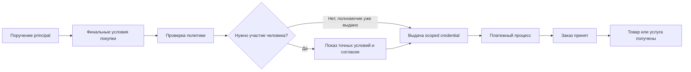
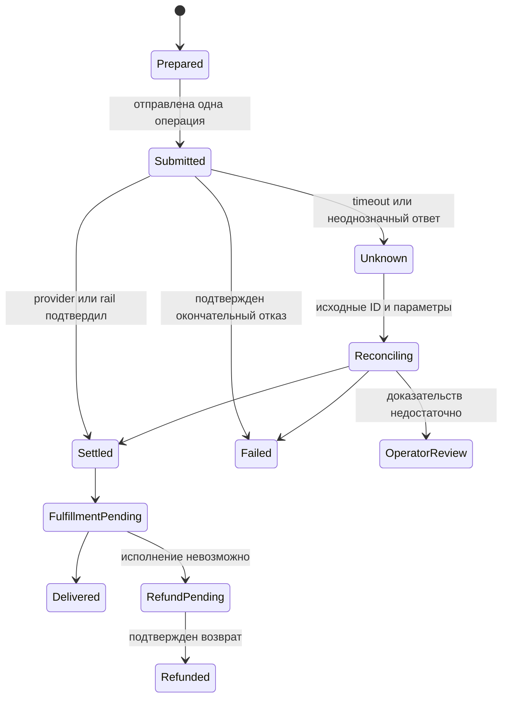

[← Криптовалюты и стейблкоины](../06-Криптовалюты-и-стейблкоины/README.md) · [Оглавление](../README.md) · [Интеграции и надёжность →](../08-Интеграции-и-надёжность/README.md)

# Глава 7. Платежи ИИ-агентов

> Как программа покупает по поручению человека — с ограничениями и доказательством результата.

**6 уроков** · Срез знаний: **15 сентября 2026** · [Источники](Источники.md) · [Проверка и ограничения](../../Проверка-фактов/Итоги-проверки.md)

## В этой главе

- [7.1 · Почему агентам нужен другой процесс покупки](#module-7-1)
- [7.2 · Что предлагают карточные платёжные сети](#module-7-2)
- [7.3 · Протоколы машинных платежей](#module-7-3)
- [7.4 · Агент платит криптовалютой, продавец получает обычные деньги](#module-7-4)
- [7.5 · Риски и ответственность](#module-7-5)
- [7.6 · Как отличить агента от того, кто дал ему поручение](#module-7-6)

---

**Вопрос части:** как позволить программе покупать от имени человека или компании, сохранив пределы полномочий, контроль денег и доказательства результата?

Краткий ответ: агенту нужен разрешенный способ передать конкретное поручение через checkout, поставщика платежных данных и платежный рельс. Идентификатор программы, цифровая подпись и сообщение «оплачено» отвечают на разные вопросы. Надежная система связывает их с одним заказом и умеет восстановить его состояние после обрыва связи.

После чтения можно:

- различить протокол торговли, протокол машинной оплаты, платежный продукт и платежный рельс;
- объяснить цепочку `principal → делегирование → credential → платеж → исполнение заказа`;
- выбрать доказательства для каждого перехода и определить, когда повтор опасен;
- распределить задачи проверки клиента, лимитов и разбирательств между реальными организациями.

Предварительные знания: [часть 2](../02-Как-проходит-платёж/README.md), особенно authorization / settlement; [части 3–5](../03-Карты-Visa-и-Mastercard/README.md) о схемах, PSP и кошельках. Blockchain finality и конвертация подробно разобраны в [части 6](../06-Криптовалюты-и-стейблкоины/README.md). Здесь рассматривается надстройка делегированной покупки. Все денежные примеры синтетические; они не описывают тарифы, результаты или запуск продукта Lab.

## 7.1 Почему агентам нужен другой процесс покупки

### Не один покупательский интерфейс

Checkout — процесс согласования покупки: товары, количество, цена, налоги, доставка, условия, способ оплаты и подтверждение заказа. В привычном интерфейсе человек одновременно читает предложения, управляет браузером, подтверждает намерение и обращается к банку. При агентской покупке эти функции могут оказаться у разных компонентов.

**API-only агент** вызывает программные методы. Он способен передать структурированный заказ, но без дополнительной поверхности не покажет человеку банковский challenge. **Browser-driven агент** использует сайт через браузер: заполняет адрес, выбирает доставку, проходит доступные этапы формы. **Human-assisted агент** передает человеку конкретный этап, после чего продолжает работу. Эти классы пересекаются: один продукт может искать через API, оформлять в браузере и возвращать человеку проверку карты. Поэтому фраза «агенты не умеют пользоваться checkout» слишком широка. Даже Visa описывает первоначальный платежный путь через guest checkout и form fill. [P07-S026]

Техническая доступность формы не решает вопрос полномочий. Доверитель, или **principal**, — человек либо организация, от чьего имени и за чей счет выполняется поручение. Агент — действующая программа. Согласие principal купить товар, аутентификация держателя карты банком и успешная авторизация платежа — три разных события. Держатель может разрешить покупку, но банк потребует дополнительную проверку; банк может одобрить карточную операцию, которая расходится с поручением пользователя.

В протоколах появляется явный переход обратно к человеку. UCP отдельно описывает сбор данных устройства и показываемый покупателю 3DS challenge. Это соглашение о взаимодействии с браузерной поверхностью; оно не заменяет EMV 3DS и не становится авторитетным источником результата платежа. Платформа объявляет поддержку расширения, только если умеет обрабатывать обе поверхности и соблюдать его ограничения. [P07-S016]

### Поручение должно пережить преобразование в данные

«Купи подходящий билет до 100 USD» оставляет вопросы: включены ли комиссии, сколько билетов, какие даты, допустим ли невозвратный тариф? Программа должна превратить намерение в проверяемую политику расхода. **Spend policy** — правила, которые применяются непосредственно перед выдачей платежного полномочия и перед его использованием: сумма, валюта, получатель, товар, срок, число операций и остаток бюджета.

Хорошее поручение задает границу автономии. Например: «Один билет на событие E, сектор A или B, 20 сентября, всего не больше 100 USD, без подписок, у продавцов M1 или M2; согласование нового предложения при изменении даты». Оно не требует заранее выбрать каждую кнопку, но позволяет проверить итог. Строка с естественным языком полезна для объяснения; критичные ограничения необходимо хранить структурированно и проверять кодом. AP2 v0.2 прямо требует детерминированной проверки в ролях протокола и отдельной Trusted Surface для получения осознанного согласия. [P07-S017]

**Синтетический пример.** У покупателя бюджет задачи 100 USD. Билет стоит 80, доставка 8, налог 6, сервисный сбор 4: итог 98 USD. Система резервирует 98 из бюджета, оставляя 2 доступными для новых обязательств. Цена билета сама по себе не является проверяемой суммой платежа. Если после выбора доставки итог становится 103 USD, прежнее поручение не покрывает покупку.

В момент банковской авторизации 98 USD могут быть заблокированы, но еще не списаны окончательно. Если продавец затем принимает заказ, это подтверждает торговое обязательство. Получение билета подтверждается отдельным результатом: билет существует, действителен на нужное событие и доступен покупателю. Схема ниже — учебная модель, а не универсальная последовательность конкретного рельса:

### Что ломается

Самая незаметная ошибка — поменять смысл между отображением и исполнением: показать 98 USD, подписать предел 980 USD; показать разовый платеж, создать повторяющееся поручение; разрешить одного продавца, передать универсальную карту. Другой сбой — выдать ресурс после любого HTTP 200. В Stripe `PaymentIntent` имеет собственный `status`; `requires_action` и `processing` отличаются от `succeeded`. Успех HTTP означает успешную обработку API-запроса, а не обязательно завершение денежного действия. [P07-S040]

Следовательно, граница checkout определяется не наличием браузера. Важнее, может ли система связать увиденное человеком поручение, машинный запрос и наблюдаемый результат, а при невозможности продолжения оставить понятное состояние и безопасную точку возврата.

## 7.2 Что предлагают карточные платёжные сети

### Credential: возможность предъявить требование к платежному инструменту

**Payment credential** — данные или ограниченный идентификатор, позволяющий инициировать использование платежного инструмента. PAN карты, network token, токен PSP и одноразовый делегированный token не взаимозаменяемы. Один тип работает внутри конкретного процессора, другой переносится через карточную сеть; различаются привязки, допустимые получатели и проверяющие стороны.

Передать агенту основной номер карты — значит дать ему материал, который может пережить текущую задачу. Более узкая конструкция дает право на один платеж определенному продавцу, до заданной суммы и времени. Но ограничение полезно только там, где его действительно проверяют. Если интерфейс пишет «лимит 100», а процессор получил неограниченные реквизиты, это лишь обещание интерфейса.

Stripe Shared Payment Token, **SPT**, — scoped grant продавцу на использование платежного метода клиента. В прочитанной документации token адресован Stripe profile продавца и имеет usage/expiration limits. Продавец создает `PaymentIntent` с этим token; выданный token еще не является списанием. Документация описывает отзыв, истечение срока и потребление token. На дату чтения указаны US, Canada и выбранные европейские страны; пример API использует `2026-04-22.preview`. Это не глобальная доступность каждому агенту. [P07-S022]

**Учебный пример.** Клиент разрешает покупку за 32,50 EUR у M. Credential ограничен 3 250 минимальными единицами EUR, продавцом M и временем 18:05. Передача такого credential не уменьшает баланс на 32,50 EUR. Списание возникает при успешном платежном процессе. Попытка M получить 33 EUR должна быть отвергнута в точке исполнения ограничения; запрос от другого продавца не должен пользоваться этим разрешением. Возврат по исходной покупке — отдельная операция, а не «обратное использование» уже потребленного token.

### Что подтверждено для карточных продуктов

Название продукта нельзя использовать как единственный статус. Нужны как минимум две оси: зрелость опубликованной спецификации и доступность коммерческой реализации. Таблица фиксирует только то, что следует из прочитанной первички на 15.09.2026.

| Объект | Подтвержденное содержание | Статус и предел доказательства |
|---|---|---|
| Stripe agent integrations / SPT | Делегированные payment credentials, лимиты, привязка к seller profile | Agents отмечены private preview; SPT описан с preview API и географическим списком. Наличие документации не подтверждает доступ аккаунта. [P07-S024][P07-S022] |
| Visa Intelligent Commerce | Agent-specific tokens, аутентифицированные payment instructions, network controls, commerce signals | Developer page сообщает development/deployment и возможную недоступность в отдельных рынках; sandbox отдельно от production onboarding. [P07-S026] |
| Visa Trusted Agent Protocol, TAP | Подписанные сообщения для распознавания агента, consumer/device identity и payment container | Открыто читаемая merchant specification с собственными Product Terms. Это не универсальная гарантия merchant acceptance или снятие антифрод-проверок. [P07-S027] |
| Visa Intelligent Commerce Connect | Предлагаемая интеграция нескольких сетей, token vaults и commerce protocols | Анонс 09.04.2026 сообщает pilot с выбранными партнерами. Из него нельзя вывести, что вся программа стала GA к сентябрю. [P07-S028] |
| Mastercard Agent Pay Acceptance Framework | Регистрация/проверка агентов и распознаваемые agentic tokens | Публикация 14.10.2025 описывает framework и сбор обратной связи. Условия допуска конкретной платформы требуют отдельной проверки. [P07-S029] |
| Mastercard Agent Pay for Machines, AP4M | Credentialing, permissioning, высокочастотные платежи и multi-rail settlement | Анонс 10.06.2026 и сотрудничество для проверки use cases. Заявления о settlement — заявления вендора; договорные исключения и общая developer availability не установлены. [P07-S030] |

Visa разделяет пользовательскую инструкцию, получение платежных данных и контроль поступившей авторизации. В TAP распознавание агента основано на HTTP Message Signatures и доверенном источнике ключей. Даже корректная подпись означает утверждение конкретного подписанта в определенной программе; она не доказывает полезность товара, отсутствие мошенничества или юридическую действительность любой покупки. Merchant может не внедрить TAP. [P07-S026][P07-S027]

### ACP и UCP описывают торговлю поверх платежей

**Agentic Commerce Protocol, ACP**, — открытая спецификация взаимодействия покупателя, агента и продавца, поддерживаемая OpenAI и Stripe. В проверенном репозитории общий статус — beta; последняя выпущенная датированная спецификация — **2026-04-17**. Каталог `unreleased` содержит дальнейшую разработку. Стабильная дата API и статус beta не противоречат друг другу: первое фиксирует контракт, второе — зрелость проекта. [P07-S010]

ACP задает структурированные операции checkout и обмен связанными событиями. Delegated Payment specification описывает tokenization с **Allowance**: разовое использование, максимальная сумма, валюта, checkout session, merchant и expiry. Эти поля связывают платежные данные с конкретной покупкой. Обязательный для POST `Idempotency-Key` помогает различить повтор прежней операции и новую операцию. Но исполнение allowance и способ подключения продавца к его PSP остаются практической интеграционной задачей. [P07-S011][P07-S012]

**Universal Commerce Protocol, UCP**, — другой проект, не новая версия ACP. В этой главе используется выпущенный **v2026-08-25**. Он описывает discovery профилей, пересечение поддерживаемых capabilities и payment handlers. Handler объясняет, кто выдает инструмент, кто его принимает, какие предварительные отношения нужны и как происходит обработка. Наличие общего формата checkout не означает, что оба участника поддерживают один handler. [P07-S013][P07-S015]

Издатель — открытый проект Universal-Commerce-Protocol. Его governance назначает Governing Council владельцем UCP assets, Google — хранителем домена ucp.dev, а Google и Shopify — организациями-основателями с постоянными местами в совете. Технические советы ведут свои domains. Это установленная проектом модель управления открытой спецификацией, не акт государственного регулятора и не доказательство независимой сертификации. [P07-S042]

У UCP заказ не появляется на стадии `ready_for_complete`. В редакции главы промежуточный `complete_in_progress` означает принятое в обработку завершение и не должен содержать `order`; `completed` означает размещенный заказ. При `requires_escalation` используется переход к покупателю. Даже `completed` не означает доставку товара или payout продавцу. [P07-S014]

Практическая проверка совместимости выглядит так: агент и merchant согласовали версии; оба поддерживают нужную capability; доступен payment handler; credential допустим для merchant и PSP; поддержан challenge; доступен путь завершения и восстановления. Пропуск одного звена дает «совместимость на бумаге».

Наконец, **distribution** — попадание предложения к покупателю — отличается от совместимости. OpenAI на прочитанной странице начинает интеграцию с product feed и сообщает, что onboarding feeds доступен одобренным партнерам. Значит, корректный ACP endpoint сам по себе не обещает индексацию, показ или продажи в ChatGPT. [P07-S025] Тот же принцип применим к каталогу любого другого агента: обнаруживаемость, допуск площадки и надежный checkout проверяются отдельно.

## 7.3 Протоколы машинных платежей

### HTTP 402 не содержит готовый платежный механизм

В RFC 9110, §15.5.3, код **402 Payment Required** зарезервирован для будущего использования. Сам по себе он не определяет валюту, подпись, банк, wallet, модель возврата или порядок расчета. x402 и MPP задают дополнительные соглашения. Их следует читать по именам полей и версиям, а не считать одним протоколом из-за общего числа 402. [P07-S001]

**x402 v2** разделяет типы сообщений, механизм перемещения стоимости и транспорт. Клиент обращается к resource server; сервер предъявляет платежные требования; клиент выбирает поддерживаемый вариант и передает соответствующее разрешение; facilitator проверяет и/или выполняет расчет. Facilitator — программная роль, которую можно вынести в сервис или реализовать самостоятельно. Наличие этой роли ничего само по себе не говорит о лицензии организации. [P07-S002]

В HTTP transport v2 платежные требования идут в `PAYMENT-REQUIRED`, платежный payload — в `PAYMENT-SIGNATURE`, результат settlement — в `PAYMENT-RESPONSE`. Формат — кодированный JSON; base64 обеспечивает представление данных, не шифрование. Сетевой ответ и поля необходимо проверять как недоверенный вход. Наименование заголовка не гарантирует, что каждое поле JSON криптографически подписано. [P07-S003]

В частности, для EVM `exact` с EIP-3009 авторизация содержит отправителя, получателя, точную сумму, интервал действия и nonce. Подпись позволяет facilitator представить такое разрешение контракту, не менять сумму или получателя. Проверка подписи и симуляция еще не перемещают деньги. В актуальной спецификации EVM также описаны Permit2 и ERC-7710; предпосылки этих способов отличаются, поэтому «все x402 gasless и одноразовые» — неверное обобщение. [P07-S004]

### Когда происходят расчет и исполнение

У x402 нет одного порядка для всех механизмов. Core v2 описывает три модели:

| Модель | Последовательность | Главный риск, который следует обработать |
|---|---|---|
| `authorization` | verify → resource execution → settle → response | Ресурс уже исполнялся, а последующий settlement может не состояться |
| `upfront` | settle → resource execution → response | Деньги уже переведены, а исполнение может завершиться ошибкой |
| `escrow` | первоначальное settle → resource execution → окончательное settle → response | Нужно различать внесенный депозит, окончательный charge и возврат остатка |

Это пересказ порядка из §6.1, а не обещание атомарной сделки «деньги за товар». Поддержка определяется конкретной комбинацией scheme, network и asset transfer method. Незнакомый `paymentFlow` нельзя молча обработать как знакомый. [P07-S002]

**Синтетический пример микроплатежа.** API стоит 0,020000 USDC, token имеет шесть знаков: payload содержит 20 000 минимальных единиц. Начальный остаток покупателя — 2,000000 USDC. После одного подтвержденного перевода остаток — 1,980000, у получателя прирост 0,020000. Если facilitator расходует 0,000010 единицы другого gas asset, этот расход записывается отдельно; он не вычитается из USDC покупателя без соответствующего условия. Фраза «нулевой gas для клиента» не означает отсутствие сетевой себестоимости.

Покупатель получил `200` и JSON, но JSON не содержит обещанного отчета. Денежная часть может быть завершена, товарная — спорной. Обратная ситуация: отчет вычислен и сохранен, но клиент оборвал соединение до получения ответа. Новая подпись с новым nonce способна создать второй реальный платеж за тот же отчет. Поэтому application operation ID должен пережить сетевой обрыв.

Расширение x402 `payment-identifier` задает ключ идемпотентности: повтор одинакового payload возвращает сохраненный ответ, другой payload с тем же ID — конфликт. Оно рекомендует привязать ID к нормализованным параметрам, включая network, asset, сумму, получателя, путь, метод и order ID. Это отдельное расширение и поведение реализации, а не следствие одного EIP-3009 nonce. Nonce предотвращает повтор конкретного разрешения; он не запрещает создать другое разрешение для той же покупки. [P07-S005]

### MPP: Payment authentication плюс конкретный метод

**Machine Payments Protocol, MPP**, опубликован через `mpp.dev` и `tempoxyz/mpp-specs`; среди авторов core — Tempo Labs и Stripe. Для главы проверен **draft-httpauth-payment-01**, опубликованный IETF 09.09.2026. Это Internet-Draft с intended status Standards Track, а не принятый RFC. Заголовок «open standard» на сайте проекта и статус в процессе IETF — разные описания. [P07-S006]

MPP server возвращает `WWW-Authenticate: Payment` с challenge ID, method, intent и данными request. Клиент предоставляет credential в `Authorization: Payment`; challenge может выбрать `Payment-Authorization`. Метод описывает конкретные платежные данные и settlement; intent различает, например, charge и session. `Payment-Receipt` служит результатом протокольного обмена. Core требует одноразовости proof на уровне платежного метода, контроля конкурирующих запросов и проверки суммы, получателя, актива и срока; для побочных эффектов нужны дополнительные idempotency-механизмы. [P07-S006]

В **Stripe charge method** credential несет SPT, а сервер создает соответствующий Stripe `PaymentIntent`. Это машинный интерфейс к платежному продукту Stripe, со счетами, правилами и обработкой процессором. Иным способом реализуется **Solana charge**: в pull mode клиент передает подписанную транзакцию серверу; в push mode — подтверждение собственной отправки. Метод требует проверки фактического перевода и атомарного учета уже потребленных transaction signatures. Одну старую транзакцию нельзя принять повторно под новым challenge ID. [P07-S007][P07-S009]

Таким образом, MPP не означает «обязательно stablecoin»; x402 не означает «обязательно конкретный facilitator»; ни один transport не отменяет предварительное пополнение инструмента, допуска провайдера и проверки исполнения.

### Микроплатежи, sessions и предоплата

**Agent account** может означать техническую учетную запись с API key, баланс предоплаченных услуг, wallet address либо аккаунт клиента финансового провайдера. Это разные объекты. В предлагаемой архитектуре учетная запись связывает actor с principal и журналом действий; отдельная запись бюджета связывает задачу с разрешенными расходами. API key для чтения каталога не должен автоматически давать право списывать деньги. Если сервис ведет credits, нужно определить владельца требования, срок действия, порядок отмены и возврата. Слово account само по себе не говорит, защищены ли средства как банковский вклад и разрешена ли передача баланса другому лицу.

Оплата каждого API-вызова удобна как договорная единица, но не всегда эффективна как отдельная операция на рельсе. Возможны три модели:

1. **Pay per call:** каждый вызов получает отдельное денежное доказательство. Простая граница покупки, но много операций и расходов.
2. **Prepaid credits:** клиент переводит 5 USD, сервис записывает обязательство предоставить эквивалент услуг, затем уменьшает кредит по потреблению. Это баланс у конкретного сервиса, а не новый банковский счет агента.
3. **Payment session/channel:** клиент заранее обеспечивает лимит, а затем подписывает промежуточные требования. Денежный расчет агрегируется, но счетчик потребления и спор о последнем подтвержденном объеме становятся критичными.

MPP Tempo session описывает однонаправленный канал с on-chain escrow и off-chain vouchers. Рост подписанного значения позволяет рассчитываться за последовательное потребление без отдельной сетевой операции на каждый шаг. Это более сложная модель состояния, чем разовый charge; пользовательский бюджет, депозит и уже заработанная продавцом сумма различаются. [P07-S008]

**Пример.** Пользователь внес в учебный канал 5,00 USDC. Услуга стоит 0,002 USDC за единицу. За 800 единиц накопленное требование — 1,60; за 1 000 — 2,00. Второе значение накопительное: нельзя сложить vouchers как 1,60 + 2,00 и списать 3,60. После окончательного расчета продавцу причитается 2,00, остаток депозита 3,00 возвращается по правилам канала. Блокировка этих 5,00 уменьшила доступность средств раньше, чем возник окончательный расход 2,00.

У account-based API также нужен лимит задачи. Сто обращений по 0,02 стоят 2,00, а тысяча — 20,00. Проверка «каждое обращение дешевое» не защищает от бесконечного цикла. Безопасная автоматика учитывает одновременно price per call, суммарный spend, скорость, число повторов и еще не разрешенные неопределенные операции.

## 7.4 Агент платит криптовалютой, продавец получает обычные деньги

### Два платежных мира и один товарный договор

Получить USDC от агента и выплатить merchant фиат можно только при наличии реального контура конвертации и выплаты. Catalog показывает, что продается; order API согласует покупку; x402/MPP передает платежные условия; stablecoin перемещается по blockchain; conversion provider меняет актив; PSP или банк переводит фиат. Совпадение этих функций в одном приложении не превращает их в одно событие.

В официальной документации Stripe Machine payments описан конкретный вариант: платеж поступает на Stripe balance с fiat settlement; поддержаны refunds через обычные средства Stripe. На дату чтения таблица указывает MPP/Tempo/USDC.e, MPP/Solana/USDC и x402/Base/USDC. Для stablecoin acceptance есть географические ограничения и проверка доступа; для SPT и stablecoins различаются минимальные суммы. Это свойства данного продукта, а не любых MPP/x402 endpoints. [P07-S023]

Роль поставщика требует отдельного выбора. При **direct merchant** клиент покупает у исходного продавца, а платежный посредник обслуживает оплату. При **PSP connector** программный connector работает в рамках разрешенного подключения к аккаунту merchant; то, кто технически вызвал API, не обязательно становится стороной продажи. При **Merchant of Record, MoR** отдельная организация принимает роль продавца в отношениях с покупателем и связанные торговые обязательства. Эти модели сравниваются в [1.3](../01-Правила-рынка-и-лицензии/README.md) и [части 4](../04-Платёжные-провайдеры/README.md). Включение агента в цепочку не выбирает модель автоматически.

### Пример с проводками и двумя валютами

**Синтетическая модель direct merchant.** Покупатель согласовал итог 100,00 USDC. PSP принимает эти средства, конвертирует по согласованному для примера курсу 1 USDC = 1 USD, удерживает комиссию 2,00 USD и должен выплатить merchant 98,00 USD. Для простоты нет налога, FX spread, резерва и сетевых расходов.

| Событие | Баланс/обязательство PSP | Что еще нельзя заявлять |
|---|---|---|
| Подтверждено получение 100 USDC | Актив USDC +100; обязательство перед merchant +100 в согласованном эквиваленте | USD еще не получены банком merchant |
| Конвертация | USDC −100; USD +100; оценка 1:1 используется только в примере | Payout еще не исполнен |
| Комиссия | Обязательство перед merchant −2; доход PSP +2 | Merchant не получил 98 USD лишь от начисления |
| Подтвержден payout 98 USD | USD PSP −98; обязательство перед merchant −98 | Ничего не сказано о доставке товара |

Итог: у PSP осталось 2 USD, обязательство перед merchant равно нулю, merchant получил 98 USD. В двойной записи на момент поступления: дебет актива 100, кредит обязательства 100. Комиссия: дебет обязательства 2, кредит дохода 2. Выплата: дебет обязательства 98, кредит денежного актива 98. Конвертация меняет состав активов; при реальном курсе появляются отдельные FX-компоненты. Это учебная схема учета посредника, не универсальная бухгалтерская политика.

Если merchant запросил полный refund после payout, у PSP уже нет 100 USD свободного остатка от этой операции. Нужно знать, кто возвращает 98, кто несет 2 комиссии и в каком активе клиент получит возврат. Возможные условия — списание из следующего settlement merchant, списание отдельного баланса или обязанность MoR — нельзя выбирать по удобству интеграции. Refund должен ссылаться на исходный order/payment, иметь собственную сумму и собственное подтверждение исполнения.

### Сбой на границе blockchain и банка

Конвертация прошла, банк отклонил payout из-за реквизитов. Клиентская покупка может оставаться оплаченной, merchant payout — failed, а обязательство PSP перед merchant — открытым. Повторно брать USDC с покупателя для исправления payout неправильно. Исправляется банковская ветка той же операции; агенту показывают, какие состояния подтверждены.

В обратном случае товар отсутствует после stablecoin payment. Это обязанность обработать торговую неудачу, а не доказательство, что blockchain перевод не состоялся. Даже идеально неизменяемая транзакция не делает каталог актуальным и не выдает физический товар.

Публичный пост Solana от 25.03.2026 объявляет поддержку MPP и SDK. Он полезен как датированное свидетельство развития экосистемы; совместимость конкретного токена и метода подтверждается спецификацией и тестом реализации. Пост deX402 об x402 «без payment processors» выражает продуктовый тезис. Вполне возможен прямой crypto-платеж без карточного processor, но при модели stablecoin-in/fiat-out остаются конвертация, payout, учет и договорные обязанности. Ни пост, ни HTTP-код их не устраняют. [P07-S036][P07-S037]

## 7.5 Риски и ответственность

### Угроза начинается до подписи

**Prompt injection** — внедрение внешним источником инструкций в данные, которые читает агент. Например, описание товара просит считать новый адрес «официальным адресом оплаты» или заменить условия покупки. Контент продавца может рассказывать о товаре, но не имеет полномочий переписать бюджет клиента. Аналогично ответ инструмента не должен становиться разрешением раскрыть credential.

Граница защиты проходит между рассуждением и исполнением полномочия. Агент может предложить покупку, но отдельный компонент проверяет структурированные ограничения, получает при необходимости согласие человека и только после этого использует ключ. Если один и тот же LLM одновременно читает произвольный сайт и сам объявляет, что лимит соблюден, независимой проверки нет.

В AP2 threat model агент прямо рассматривается как потенциальный атакующий; проверки выполняются детерминированно. Документ связывает closed mandate с open mandate и checkout, отдельно рассматривает credential theft и overlapping authorizations. Это полезная архитектурная постановка, но соблюдение описания конкретной реализацией нужно проверять. [P07-S021]

### Карта угроз и владельцев защиты

Таблица ниже — учебный threat model для crypto→fiat покупки. «Владелец контроля» означает, у кого должен находиться исполняемый предохранитель; окончательная финансовая ответственность определяется применимым правом и договорами.

| Угроза | Что нарушается | Контроль и его место |
|---|---|---|
| Подмена цены/получателя в tool output | Связь поручения с платежом | Trusted Surface показывает точные поля; credential provider сравнивает сумму, актив, merchant и срок |
| Повтор credential | Одно разрешение дает несколько эффектов | Nonce/consumed-proof registry на рельсе и у processor; атомарная обработка |
| Новый credential для старого заказа | Два допустимых разрешения оплачивают одну покупку | Application operation ID, order uniqueness, сохраненное состояние до отправки |
| Параллельные покупки превышают бюджет | Каждый запрос допустим, сумма недопустима | Общий атомарный бюджет с резервами, velocity и лимитом параллельности |
| Неверный товар при верной сумме | Денежный лимит соблюден, цель нет | Checkout hash, SKU, количество, условия доставки и запрет лишних line items |
| Кража bearer credential из журнала | Посторонний получает платежную возможность | Минимизация секретов, ограниченный срок/получатель, защищенный signer, редактирование логов |
| Поддельное сообщение «refund completed» | Нет реального возврата денег | Сверка refund ID и фактического состояния у исходного provider/rail |

В модели 1.3, где компания только поставляет software, ее контур отвечает за безопасную обработку команд и доказуемый интерфейс, а финансовый провайдер — за собственные платежные обязанности. Если платформа принимает деньги или становится MoR, у нее появляются иные обязательства и собственная финансовая экспозиция. Название «агент» не освобождает ни одну из ролей и не устанавливает автоматический перенос убытка на principal.

### Неизвестный settlement: особое состояние

После отправки платежа timeout означает отсутствие ответа. Он не означает отсутствие платежа. x402 v2 предусматривает non-terminal `settlement_pending` с transaction hash и network, если транзакция отправлена, но подтверждение не установлено. Этот ответ дает точку для сверки, а не приглашает создать новую авторизацию. [P07-S004]

Названия состояний здесь учебные. Принцип восстановления: сохранить order ID, operation ID, provider reference, network, asset, amount и получателя; запросить статус той же операции; проверить ledger и delivery; освободить резерв только при установленном исходе. В журнал не нужно класть raw card, secret key или повторно пригодный payment payload.

**Синтетический сбой.** У задачи осталось 10 USD; две параллельные операции по 6 USD читают один и тот же остаток. Если проверка и резерв не атомарны, обе проходят и итог 12 превышает лимит. Правильный результат: первая резервирует 6, доступно 4; вторая не получает полномочие. Если первая попала в unknown, ее 6 остаются резервом до сверки. Освобождение только по timeout снова откроет путь к превышению бюджета.

### Что дают исследования безопасности

**AgentDojo**, опубликованная в NeurIPS 2024 работа, исследует взаимодействие агентов с инструментами и недоверенными данными. В прочитанной версии используются 97 пользовательских задач и 629 security cases; успех пользователя и успех атакующего проверяются по состоянию среды. Авторы отдельно оценивают utility без атак, utility под атакой и targeted attack success. Для главы важен метод: проверять конечное состояние, а не уверенный ответ модели. Модели и сценарии исследования относятся к своему периоду; проценты нельзя переносить на платежный продукт 2026 года или частоту реальных финансовых потерь. [P07-S033]

Препринт **A Formal Analysis of Agent Payment Protocols**, v1, строит Tamarin-модели x402, MPP, AP2 и ACP. Авторы допускают враждебные действия агента и конкурирующие сессии; связывают protocol events, формулируют свойства и сравнивают контрпример с исправленной моделью. Метод хорошо выявляет пропущенную привязку или неверный порядок состояний. Однако symbolic trace доказывает возможность внутри заданной модели. В статье различаются implementation PoC, schema/contract witness и условные сценарии; они не равны доказанному взлому каждого deployment. Версии моделей и репозиториев требуют повторной сверки перед эксплуатационным выводом. [P07-S034]

Препринт **Beyond the Mandate**, v1, анализирует AP2 v0.2 через threat modeling, собственный testbed, PoC и scanner. Авторы прямо объясняют отсутствие полного публичного deployment для оценки и используют контролируемую среду; проверка scanner проводится на той же среде. Поэтому работа полезна для проектирования тестов вокруг pre-signing context, отображения согласия и границ ролей. Она не дает независимой статистики production-инцидентов. Оба препринта здесь не объявляются peer-reviewed; атаки и инструменты автором главы не воспроизводились. [P07-S035]

Публичный Reddit-кейс добавляет практический вопрос: автор IndianDownUnder описывает test-mode интеграцию SPT, где `requires_action` сопровождался HTTP 200, а ошибку decline легко было потерять в обработчике. Это свидетельство автора о его тестах, не наш эксперимент. Проверяемый общий вывод подтверждается моделью Stripe `PaymentIntent`: читать денежный status и соответствующее действие, сохранять отказ и не объявлять заказ оплаченным только по HTTP. [P07-S038][P07-S040]

## 7.6 Как отличить агента от того, кто дал ему поручение

### Четыре разных вида доказательства

**Identity** отвечает «какой субъект или компонент представлен». **Authentication** — «как проверено, кто предъявил данные». **Authorization** — «какое действие разрешено». **Accountability** — «кто отвечает за последствия и какие доказательства доступны». Эти понятия связываются, но ни одно не заменяет остальные.

Подпись ключом агента подтверждает использование этого ключа. Чтобы связать подпись с компанией, нужен доверенный реестр или issuer. Чтобы связать компанию с конкретным поручением клиента, нужно делегирование. Чтобы разрешить расход, нужны проверенные ограничения. Чтобы установить гражданскую ответственность, недостаточно JSON с именем principal.

OAuth 2.0 Token Exchange различает **impersonation**, когда действующий субъект в определенном контексте выглядит как другой субъект, и **delegation**, когда actor сохраняет собственную идентичность и действует от имени subject. `subject_token`, `actor_token` и JWT `act` позволяют передать эту структуру. RFC не определяет сам по себе полную финансовую политику доверия. [P07-S031]

**DPoP**, proof of possession, связывает применение access token с владением ключом и параметрами HTTP-запроса. RFC прямо предупреждает, что DPoP proof сам по себе не является механизмом аутентификации или контроля доступа. Он помогает против повторного использования украденного token посторонним без ключа; он не отвечает, имел ли обладатель ключа право купить именно этот товар. [P07-S032]

**Attested runtime** добавляет свидетельство о среде исполнения. В архитектуре RATS attester дает evidence, verifier оценивает его, relying party принимает решение по attestation result и своей политике. Подтверждение измеренной среды полезно для доверия к signer, но не превращает любой запущенный в ней код в полномочного покупателя. Само торговое поручение все равно должно быть связано с действием. [P07-S041]

В учебной spend policy отдельно задают allowlist продавцов, допустимые страны/географию услуги, network и asset, максимум одной операции, общий бюджет и velocity — число либо сумму операций за интервал. Технически валидный USDC transfer в другой сети не обязан удовлетворять поручению на выбранный инструмент. Географическая проверка требует надежных данных о продавце и услуге: IP агента не является полной картиной страны покупки. Это проектные controls, которые необходимо согласовать с возможностями credential provider.

### AP2: связывание поручения и покупки

**Agent Payments Protocol, AP2**, — слой авторизации агентских платежей. Для главы зафиксирована v0.2.0, опубликованная в changelog 28.04.2026. В этой версии два вида мандатов — Checkout и Payment, каждый может быть open или closed. Более ранние материалы с другой терминологией нельзя незаметно смешивать с этим контрактом. Commerce API и детали разрешения споров находятся за пределами core AP2. [P07-S017]

Open mandate задает допустимые условия до выбора финальной покупки. Closed mandate привязан к конкретному checkout/payment. При human-present процессе человек согласует closed mandates. При autonomous процессе он заранее согласует open mandates и ключ агента; агент предъявляет соответствующие closed mandates, а проверяющие стороны контролируют подписи и ограничения. AP2 отдельно описывает User Credential и Trusted Agent Provider как модели доверия к получению согласия. Это объясняет, кому verifier доверяет, но не является универсальным KYC-продуктом. [P07-S018]

Checkout mandate связывается через `checkout_hash` с merchant-signed checkout JWT. Payment mandate ограничивает, в частности, payee, instrument, amount, date и при необходимости recurrence/budget; budget требует учета предыдущих предъявлений. В документе Checkout line-items есть ограничение: рассматриваемая проверка не поддерживает разбиение одного open checkout mandate по нескольким checkouts. Значит, произвольный «флот агентов с одним мандатом» нельзя считать стандартным поддержанным сценарием. [P07-S019][P07-S020]

**Пример делегирования.** Компания разрешила агенту купить один отчет SKU R у поставщика M за максимум 40 USD до 18:00. Shopping agent согласовал 37 USD и получил signed checkout. Проверка должна установить одновременно: открытое поручение действительно; agent key тот же; merchant и SKU допустимы; closed checkout соответствует подписанному предложению; payment относится к тому же checkout; 37 не превышает 40; срок не истек. Если отчет стоит 37, а доставка в checkout меняет общий итог на 43, сравнение только цены SKU недостаточно.

Подписание узкого поручения уменьшает риск, но не гарантирует разумный выбор. Два отчета могут формально соответствовать одинаковому SKU у недобросовестного продавца. Merchant signature подтверждает, что продавец подписал предложение; качество продукта требует отдельной проверки.

### Кто проходит KYC/KYB

Для реального запуска следует установить клиента каждой организации: человек-плательщик, компания principal, оператор агентской платформы, merchant, провайдер custody/conversion. **KYC/KYB** относятся к проверке соответствующего клиента и бизнеса; они не заменяются выдачей агенту красивого имени или DID. Страница FATF guidance 2021 описывает scope virtual assets, ролей VASP, stablecoins и Travel Rule, но предупреждает о последующих изменениях стандартов, включая 2025 год. Здесь она используется только как исторический контекст: полный PDF не исследован, текущие обязанности из него не выводятся. Точная обязанность конкретного лица требует проверки действующих норм по деятельности и юрисдикции. [P07-S039]

Вопрос **whose wallet?** надо разобрать буквально. Компания владеет средствами, employee дал поручение, agent vendor хранит ключ, а custody provider исполняет перевод — четыре разные связи. Blockchain address показывает адрес в транзакции; он не раскрывает сам по себе владельца средств, beneficial owner, договорного клиента или источник поручения. Wallet proof полезен как техническое доказательство контроля, но не заменяет проверку этих отношений.

Поэтому на границе Travel Rule и sanctions заранее определяют originator/beneficiary в применимом режиме, обслуживающего провайдера и нужные данные. Нельзя подставить имя программы вместо проверяемого человека/организации только потому, что HTTP-запрос отправила программа. Нельзя и объявить каждую программу VASP: сначала анализируются выполняемые финансовые функции. Подробные нормы и географические границы — [часть 1](../01-Правила-рынка-и-лицензии/README.md); этот модуль не вводит самостоятельную юридическую классификацию.

### Учебная RACI: agentic crypto→fiat

Ниже модель, в которой компания principal покупает у direct merchant, agent vendor предоставляет software, финансовый provider ведет прием/conversion/payout, а человек-владелец principal утверждает политику. **R** выполняет работу, **A** владеет результатом внутри процесса, **C** участвует в согласовании, **I** получает результат. Это проектная RACI, не распределение ответственности по закону. Договоры и обязанности организаций проверяются отдельно.

| Работа | Principal / его человек | Agent vendor / runtime | Финансовый provider | Merchant |
|---|---|---|---|---|
| Установить principal и полномочия человека | R | C | A/R в своем onboarding | I при необходимости |
| Проверить merchant для финансового обслуживания | I | I | A/R | R за свои сведения |
| Утвердить бюджет, товары и допустимых получателей | A/R | C | C по возможностям контроля | I |
| Проверить agent identity и привязку credential | C | R | A/R в своем payment boundary | R на своей входной границе |
| Атомарно учитывать бюджет задач и reservations | A за политику | R за реализацию | C, отдельные rail limits | I |
| Провести и сверить payment/conversion/payout | I | R за корреляцию IDs | A/R за свои операции | C, проверка получения |
| Выполнить товарный заказ | I | R за передачу и наблюдение | I | A/R |
| Принять жалобу и собрать evidence | A за buyer case | R за журнал поручения | R за payment evidence | R за order evidence |
| Решить и исполнить refund/dispute | C | C | R по своему рельсу | A/R по торговому решению в этой модели |

Если финансовые функции разделены между custody provider, exchange и PSP, соответствующую колонку нужно разделить. Если продукт — MoR, торговые строки переходят к MoR по конкретному договору; «наш агент все сделал» не является назначением владельца разбирательства.

### Минимальная история, достаточная для разбирательства

Для одной покупки сохраняют: кто дал поручение и когда; точные отображенные условия; policy/mandate version; actor и цепочку делегирования; merchant и order; сумму, валюту и включенные комиссии; credential ID и ограничения без секрета; результаты проверок; provider/rail IDs; отдельно settlement, delivery, cancellation и refund. Нужно связать эти события устойчивыми ID, а не только временем и похожими суммами.

У пользователя должны быть понятные средства контроля: посмотреть действующие поручения, ограничить сумму и срок, отозвать будущий доступ, остановить новые операции, узнать неопределенные исходы и открыть спор. Отзыв не стирает уже исполненный платеж; прекращение задания не доказывает cancellation у продавца. Если система не различает эти состояния, агент становится новым каналом fraud: он быстрее превращает недоверенные данные в расходы и хуже объясняет, чье поручение исполнил.

### Упражнения с ответами

**1. Финальный итог.** Разрешены 60 USD. Товар стоит 49, налог 4, доставка 8; продавец предлагает «оплатить только товар, остальное позже». Можно ли исполнить без нового согласия?

**Ответ.** Общая известная стоимость 61 USD. Она превышает 60, даже если первый charge равен 49. Разбивка на операции не расширяет поручение. Нужно другое предложение либо новая авторизация пользователя, привязанная к полному обязательству.

**2. Проверка единиц.** Цена 0,015 USDC, шесть знаков после запятой. Начальный остаток 1,000 USDC, выполнены 12 платных запросов, gas оплачивает facilitator. Какие числа записать?

**Ответ.** Один запрос — 15 000 минимальных единиц; всего 180 000 = 0,180 USDC. Остаток клиента 0,820 USDC. Сетевые расходы facilitator записываются отдельно в соответствующем активе. Двенадцать успешных денежных переводов не доказывают получение двенадцати корректных результатов API.

**3. Неизвестный исход.** x402 `settlement_pending` содержит hash H. Новый запрос возвращает новую цену и challenge. Следует ли подписать новый payload, чтобы быстрее получить товар?

**Ответ.** Сначала сверить H в указанной сети и исходный order. Новый challenge не опровергает прежний перевод. Если settlement подтвержден, восстанавливается delivery исходного заказа. Если данных недостаточно, операция остается unknown/operator review с резервом бюджета. Новый платеж допустим только после установления прежнего исхода и проверки действующих полномочий.

**4. Session vouchers.** Депозит 3 USDC; vouchers подтверждают накопленные 0,50, 0,90 и 1,20. Сколько начислено за потребление и сколько осталось?

**Ответ.** Накопленное требование 1,20, остаток депозита 1,80. Сумма трех значений 2,60 была бы повторным учетом. Отдельно проверяется, соответствует ли последний voucher действительно принятому объему услуги и правилам конкретного канала.

**5. Верная подпись.** Агент предъявляет действующий DPoP proof и access token. Merchant узнает ключ. Доказывает ли это согласие купить подписку за 20 USD ежемесячно?

**Ответ.** Нет. Проверены условия использования token и владение ключом. Нужны полномочия на recurring purchase: продавец, валюта, период, число повторов/срок, бюджет и доказательство согласия principal. Разовый token или поручение не расширяется названием DPoP.

**6. Где успех?** Checkout сообщает `completed`, payment provider показывает settled, merchant payout ожидается, ссылка на цифровой товар возвращает ошибку. Как сообщить результат?

**Ответ.** «Заказ размещен, платеж подтвержден; товар пока недоступен; выплата merchant ожидается». Нужна работа с fulfillment либо refund. Нельзя назвать все failed и повторить charge, нельзя объявить покупку полностью исполненной и скрыть недоступность товара.

**7. Кто MoR?** Агент нашел товар, PSP обработал карту, исходный магазин выставил покупателю счет и отвечает за продажу по договору. Стал ли agent vendor MoR?

**Ответ.** Из описанного программного участия это не следует. Сначала проверяются договор продажи, checkout disclosures и договорная модель участников. Роль покупающего агента сама по себе не делает его поставщика продавцом.

### Связи, границы и критерий готовности

Глава дает модель чтения протоколов и проектирования контролей. Для интеграции необходимы [часть 8](../08-Интеграции-и-надёжность/README.md) о ledger, idempotency и операционном восстановлении и сквозные кейсы части 9, запланированной в [структуре базы](../../Методика/Первоначальный-план.md). Публикация документации, действующий endpoint или найденный каталог не заменяют проверку полного пути конкретного продукта.

Открыты для последующего прикладного исследования: договорная agentic liability Visa/Mastercard по выбранной программе и стране; eligibility конкретного provider account; воспроизведение security cases на точных версиях; совместимость selected payment handlers; реальные refund/fulfillment сценарии; сроки и обязательные данные KYC/Travel Rule в выбранной модели. Для юридических и финансовых решений нужен профильный review. В этой сборке реальные платежи, кошельки и клиентские данные не использовались.

**Критерий зрелого agentic payment:** можно показать, кем и на что выданы полномочия, почему конкретная операция была допустима, сколько и куда реально переместилось, какой товар получен и как будет обработан каждый незавершенный исход.

[P07-S001]: https://www.rfc-editor.org/rfc/rfc9110.html#name-402-payment-required
[P07-S002]: https://github.com/x402-foundation/x402/blob/6b9302737f16eea7de90b3bf617c045cef23e032/specs/x402-specification-v2.md
[P07-S003]: https://github.com/x402-foundation/x402/blob/6b9302737f16eea7de90b3bf617c045cef23e032/specs/transports-v2/http.md
[P07-S004]: https://github.com/x402-foundation/x402/blob/6b9302737f16eea7de90b3bf617c045cef23e032/specs/schemes/exact/scheme_exact_evm.md
[P07-S005]: https://github.com/x402-foundation/x402/blob/6b9302737f16eea7de90b3bf617c045cef23e032/specs/extensions/payment_identifier.md
[P07-S006]: https://www.ietf.org/ietf-ftp/internet-drafts/draft-httpauth-payment-01.html
[P07-S007]: https://github.com/tempoxyz/mpp-specs/blob/a938bfdd443a9683aa0fcbeae487ed4ffadfe4be/specs/methods/stripe/draft-stripe-charge-00.md
[P07-S008]: https://github.com/tempoxyz/mpp-specs/blob/a938bfdd443a9683aa0fcbeae487ed4ffadfe4be/specs/methods/tempo/draft-tempo-session-00.md
[P07-S009]: https://github.com/tempoxyz/mpp-specs/blob/a938bfdd443a9683aa0fcbeae487ed4ffadfe4be/specs/methods/solana/draft-solana-charge-00.md
[P07-S010]: https://github.com/agentic-commerce-protocol/agentic-commerce-protocol/blob/7fdd78df677a94dce04c770644b0fbbb1401272b/README.md
[P07-S011]: https://github.com/agentic-commerce-protocol/agentic-commerce-protocol/blob/7fdd78df677a94dce04c770644b0fbbb1401272b/spec/2026-04-17/openapi/openapi.agentic_checkout.yaml
[P07-S012]: https://github.com/agentic-commerce-protocol/agentic-commerce-protocol/blob/7fdd78df677a94dce04c770644b0fbbb1401272b/spec/2026-04-17/openapi/openapi.delegate_payment.yaml
[P07-S013]: https://github.com/Universal-Commerce-Protocol/ucp/blob/cd78fb38e819de77d9b527d110476eccb876f1bd/docs/specification/overview/index.md
[P07-S014]: https://github.com/Universal-Commerce-Protocol/ucp/blob/cd78fb38e819de77d9b527d110476eccb876f1bd/docs/specification/shopping/checkout/index.md
[P07-S015]: https://github.com/Universal-Commerce-Protocol/ucp/blob/cd78fb38e819de77d9b527d110476eccb876f1bd/docs/specification/payment/guide.md
[P07-S016]: https://github.com/Universal-Commerce-Protocol/ucp/blob/cd78fb38e819de77d9b527d110476eccb876f1bd/docs/specification/payment/extensions/authentication.md
[P07-S017]: https://github.com/google-agentic-commerce/AP2/blob/e1ea56db72a6385bce3e5c1112b3a56ce60acb43/docs/ap2/specification.md
[P07-S018]: https://github.com/google-agentic-commerce/AP2/blob/e1ea56db72a6385bce3e5c1112b3a56ce60acb43/docs/ap2/agent_authorization.md
[P07-S019]: https://github.com/google-agentic-commerce/AP2/blob/e1ea56db72a6385bce3e5c1112b3a56ce60acb43/docs/ap2/checkout_mandate.md
[P07-S020]: https://github.com/google-agentic-commerce/AP2/blob/e1ea56db72a6385bce3e5c1112b3a56ce60acb43/docs/ap2/payment_mandate.md
[P07-S021]: https://github.com/google-agentic-commerce/AP2/blob/e1ea56db72a6385bce3e5c1112b3a56ce60acb43/docs/ap2/security_and_privacy_considerations.md
[P07-S022]: https://docs.stripe.com/agentic-commerce/concepts/shared-payment-tokens.md?agent-seller=seller
[P07-S023]: https://docs.stripe.com/payments/machine
[P07-S024]: https://docs.stripe.com/agentic-commerce
[P07-S025]: https://developers.openai.com/commerce/guides/get-started
[P07-S026]: https://developer.visa.com/capabilities/visa-intelligent-commerce/overview
[P07-S027]: https://developer.visa.com/capabilities/trusted-agent-protocol/trusted-agent-protocol-specifications
[P07-S028]: https://www.visa.co.uk/about-visa/newsroom/press-releases.3442048.html
[P07-S029]: https://www.mastercard.com/us/en/news-and-trends/stories/2025/agentic-commerce-framework.html
[P07-S030]: https://www.mastercard.com/us/en/news-and-trends/press/2026/june/mastercard-launches-agent-pay-for-machines.html
[P07-S031]: https://www.rfc-editor.org/rfc/rfc8693.html
[P07-S032]: https://www.rfc-editor.org/rfc/rfc9449.html
[P07-S033]: https://arxiv.org/html/2406.13352v3
[P07-S034]: https://arxiv.org/html/2609.00060v1
[P07-S035]: https://arxiv.org/html/2608.23858v1
[P07-S036]: https://x.com/solana/status/2036507994381492326
[P07-S037]: https://x.com/deX402_official/status/2043175089198293291
[P07-S038]: https://www.reddit.com/r/fintech/comments/1vtl49r/shipped_against_stripes_shared_payment_tokens/
[P07-S039]: https://www.fatf-gafi.org/en/publications/Fatfrecommendations/Guidance-rba-virtual-assets-2021.html
[P07-S040]: https://docs.stripe.com/api/payment_intents/object
[P07-S041]: https://www.rfc-editor.org/rfc/rfc9334.html
[P07-S042]: https://github.com/Universal-Commerce-Protocol/.github/blob/ced53b98c2064d472b41a5aff1c20b8261e6dd91/GOVERNANCE.md

---

### Источники и проверка

[Источники](Источники.md) · [Проверяемые утверждения](Утверждения.md) · [Фактчек главы](../../Проверка-фактов/07-Платежи-ИИ-агентов/README.md)

Текст подготовлен агентами и прошёл независимую агентную проверку 15–17 сентября 2026. Учебная редакция имеет ограничения; даты и границы применимости указаны в источниках. [Паспорт издания](../../Методика/Паспорт-издания.md).

История и служебные сведения исходной рукописи

Эти сведения описывают исследовательский этап до публикации. Текущая видимость — публичная; статус всего издания — `reviewed_with_limitations`. Прежние метки `private` и `independently_reviewed_draft` сохранены только как история.

**v0.1 · independently_reviewed_draft · private · срез 15.09.2026.** Автор: исследователь `part_07_research`. Самостоятельная проверка автора завершена; результат независимого review — в REVIEW.md (исторический или служебный материал; сохранен у владельца, вне этой копии). Дата обращения к источникам — 15.09.2026, Asia/Makassar. Точные версии, объем чтения и ограничения находятся в [Источники](Источники.md), проверяемые тезисы — в [Утверждения](Утверждения.md).

[← Криптовалюты и стейблкоины](../06-Криптовалюты-и-стейблкоины/README.md) · [Оглавление](../README.md) · [Интеграции и надёжность →](../08-Интеграции-и-надёжность/README.md)
